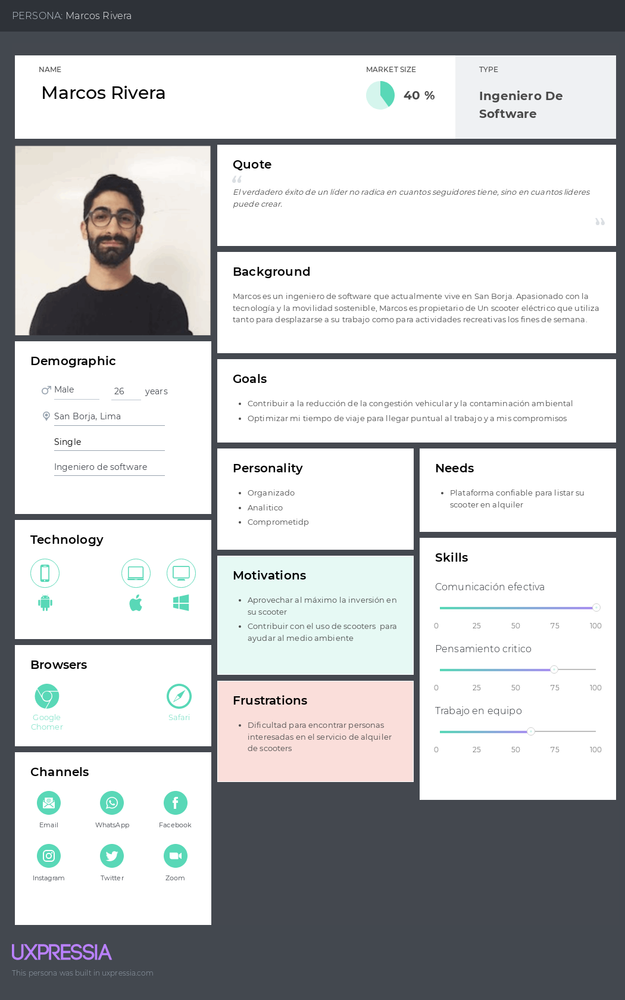
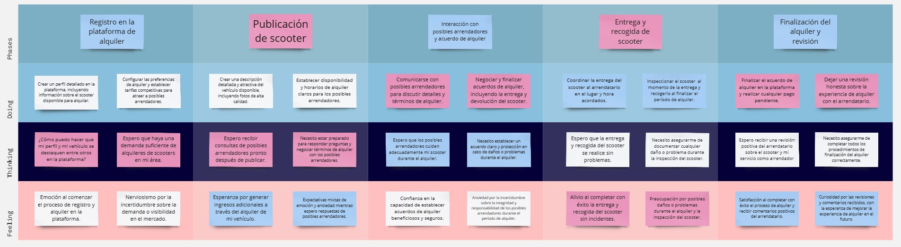
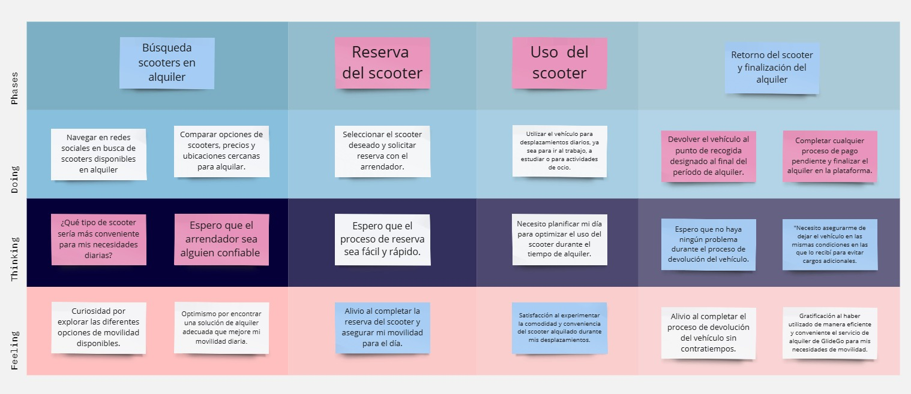

# Capítulo II: Requirements Elicitation & Analysis
## 2.1. Competidores.

### 2.1.1. Análisis competitivo

<table border="1px" style="text-align: center; width: 100%;">
  <tr>
    <th colspan="6" valign="top">Competitive Analysis Landscape</th>
  </tr>
  <tr>
    <td colspan="2" valign="top">¿Por qué llevar a cabo este análisis?</td>
    <td colspan="4" valign="top">El objetivo de este análisis es identificar las características de los competidores y encontrar maneras de diferenciarnos.</td>
  </tr>
  <tr>
    <td colspan="2" rowspan="2" valign="top">Startup y Competidores</td>
    <td valign="top">MoviRent</td>
    <td valign="top">City Bike</td>
    <td valign="top">Grin</td>
    <td valign="top">Emove</td>
  </tr>
  <tr>
    <td valign="top"></td>
    <td valign="top"></td>
    <td valign="top"></td>
    <td valign="top"></td>
  </tr>
  <tr>
    <td rowspan="2" valign="top">Perfil</td>
    <td valign="top">Overview</td>
    <td valign="top">Servicio de alquiler de scooters para la ciudad de Lima metropolitana.</td>
    <td valign="top">Servicio de alquiler de bicicletas en Miraflores, Lima.</td>
    <td valign="top">Servicio de alquiler de scooters para Lima metropolitana.</td>
    <td valign="top">Servicio de alquiler de vehículos, servicios de reparaciones, venta de equipos y accesorios.</td>
  </tr>
  <tr>
    <td valign="top">Ventaja competitiva ¿Qué valor ofrece a los clientes?</td>
    <td valign="top">Una plataforma que permite poner en alquiler scooters, ganar dinero con ello. Asimismo, se puede rentar mediante suscripcion</td>
    <td valign="top">La forma de alquiler es mediante registros por plataforma web o móvil, la suscripción está disponible desde pase diario, mensual y anual.</td>
    <td valign="top">Permite a los usuarios alquilar mediante suscripción sus scooters. Además, ofrece mantenimiento gratuito.</td>
    <td valign="top">Permite a los usuarios el alquiler de vehículos, la compra y venta de accesorios nuevos como de segunda mano, a través de su sitio web.</td>
  </tr>   
  <tr>
    <td rowspan="2" valign="top">Perfil de Marketing</td>
    <td valign="top">Mercado objetivo</td>
    <td valign="top">Personas de entre 18 y 65 años que requieren movilizarse por la ciudad de Lima y personas de entre 18 y 65 para el alquiler.</td>
    <td valign="top">Personas mayores a 18 años, para habitantes de Lima, visitantes y turistas.</td>
    <td valign="top">Personas mayores de 15 años que se deben movilizar por Lima Metropolitana diariamente.</td>
    <td valign="top">Personas mayores de 18 años que busquen promover los vehículos de micromovilidad.</td>
  </tr>
  <tr>
    <td valign="top">Estrategias de marketing</td>
    <td valign="top">Publicidad por redes sociales y vallas publicitarias en calles de mayor afluencia.</td>
    <td valign="top">Publicidad en redes sociales.</td>
    <td valign="top">Publicidad en redes sociales y afiches.</td>
    <td valign="top">Publicidad en redes sociales.</td>
  </tr>
  <tr>
    <td rowspan="3" valign="top">Perfil de Producto</td>
    <td valign="top">Productos & Servicios</td>
    <td valign="top">Alquilerde scooters.</td>
    <td valign="top">Alquiler de bicicletas.</td>
    <td valign="top">Alquiler de scooters y mantenimiento.</td>
    <td valign="top">Alquiler de vehículos y servicio de reparaciones.</td>
  </tr>
  <tr>
    <td valign="top">Precios & Costos</td>
    <td valign="top">
      Planes de suscripción: 
      - Plan mensual: s/. 39 
      - Plan trimestral: s/. 99 
      - Plan anual: s/. 199 
    </td>
    <td valign="top">
      Planes de suscripción:  
      - Diario: s/4.33    
      - Mensual: s/19.50  
      - Anual: s/151.73 
    </td>
    <td valign="top">
      Planes de suscripción: 
      - Mensual: S/. 139 
      - Bimestral: S/. 239 
      - Trimestral: S/. 329 
    </td>
    <td valign="top">
      Costo de alquiler: 
      - 2 horas: s/. 60 
      - 4 horas: s/. 80 
      - 1 día: s/. 120 
    </td>
  </tr>
  <tr>
    <td valign="top">Canales de distribución (Web y/o Móvil)</td>
    <td valign="top">Principalmente a través de su sitio web oficial.</td>
    <td valign="top">Principalmente a través de su sitio web, con posibilidad de acceso móvil.</td>
    <td valign="top">Principalmente a través de su sitio web oficial.</td>
    <td valign="top">Principalmente a través de su sitio web oficial.</td>
  </tr>
  <tr>
    <td rowspan="4" valign="top">Análisis SWOT</td>
    <td valign="top">Fortalezas</td>
    <td valign="top">
      Modelo de negocio innovador que combina alquiler por suscripción y oportunidad para propietarios de generar ingresos adicionales.
    </td>
    <td valign="top">
      Posibilidad para personas que optan por un transporte eficiente y sano.
    </td>
    <td valign="top">
      Base de clientes establecida, está presente en lugares con mayor afluencia de tráfico.
    </td>
    <td valign="top">
      - Variedad de servicios 
      - Movilidad sostenible 
      - Flexibilidad de precios 
    </td>
  </tr>
  <tr>
    <td valign="top">Debilidades</td>
    <td valign="top">
      Dependencia de la disponibilidad de los vehículos por parte de los propietarios. 
      No contamos con un sistema de rastreo sofisticado.
    </td>
    <td valign="top">
      No cuenta con servicio de mantenimiento.
    </td>
    <td valign="top">
      No cuenta con aplicación móvil, costos elevados. Poca publicidad.
    </td>
    <td valign="top">
      - Dependencia tecnológica 
      - Competencia 
      - Costos de mantenimiento 
      - Dependencia climática 
    </td>
  </tr>
  <tr>
    <td valign="top">Oportunidades</td>
    <td valign="top">
      Es innovador y no afecta al medio ambiente. Asimismo, tiene un impacto positivo en la economía y salud de los usuarios.
    </td>
    <td valign="top">
      La ciudad de Miraflores cuenta con vías exclusivas para bicicletas y posibilidad para expandir a más distritos Limeños.
    </td>
    <td valign="top">
      Expandir su base de usuarios ya sea con mayor publicidad o más alcance a zonas de cobertura del servicio.
    </td>
    <td valign="top">
      - Expansión de mercado 
      - Alianzas estratégicas 
      - Diversificación de servicios 
      - Tendencia de movilidad urbana 
    </td>
  </tr>
  <tr>
    <td valign="top">Amenazas</td>
    <td valign="top">
      Creciente aumento de competidores en el mercado de alquiler de scooters.
    </td>
    <td valign="top">
      Las invasiones de motorizados a ciclovías y los robos de equipos (bicicletas) en lugares con poca seguridad.
    </td>
    <td valign="top">
      Cambios en la regulación del transporte.
    </td>
    <td valign="top">
      Cambios en la regulación, críticas negativas y avances tecnológicos representan amenazas potenciales para la operación y la reputación de Samma en el mercado.
    </td>
  </tr>
</table>

### 2.1.2. Estrategias y tácticas frente a competidores

Teniendo en cuenta el analisis SWOT se propone las siguientes estrategias competitivas:

#### Estrategias competitivas para MoviRent:

1. Liderazgo en costos:

Podemos buscar optimizar los procesos que permitan reducir los gastos de infraestructura y ofrecer los servicios a precios mas competitivos que los competidores.

2. Diferenciación:

MoviRent puede enfocarse en desarrollar caracteristicas y funcionalidades unicas que destaquen en su plataforma como lider en innovacion.

3. Enfoque en segmentos especificos del mercado:

MoviRent puede enfocarse en segmentos especificos del mercado donde pueda ofrecer un valor diferenciado y adaptado.
Aprovecha la oportunidad de expandir nuestro servicio a otras áreas metropolitanas y turísticas, más allá de la ubicación actual de nuestros competidores. Esto nos permitirá alcanzar a una base de usuarios más amplia y capturar nuevos mercados.

#### Tácticas específicas para MoviRent:

1. Estrategia de precios

Ajustar estrategicamente los precios de suscripción para competir de manera efectiva en el mercado

2. Inversion en marketing diferenciado

Desarrollar mensajes y campañas de marketing que resalten las fortalezas unicas y la propuesta de valor de MoviRent.

## 2.2. Entrevistas

### 2.2.1. Diseño de entrevistas

#### Entrevistas segmento 01: Owner
1. ¿Cual es tu nombre completo?
2. ¿Cuántos años tienes? ¿En que distrito resides actualmente?
3. ¿En que sector se desempeña laboralmente? ¿Que funciones realizas?
4. ¿Para trabajar que dispositivo se le hace mas comodo? ¿Que marca es?
5. ¿Que navegador web prefiere utilizar en su dia a dia y por qué?
6. ¿Que medios informativos usa con mayor frecuencia? ¿Y de entretenimiento?
7. ¿Hace cuantos años te dedicas a rentas sus vehiculos?
8. ¿Que estrategia de marketing haces a las personas nuevas para que te alquilen tu vehiculo?
9. ¿Como manejas las tarifas para tus vehiculos?
10. ¿Cómo te gustaría que sean las tarifas de alquiler?
11. ¿Manejas algún limite o reglas para las personas que te alquilan?
12. ¿Como te contactas con tus clientes o personas quienes te alquilan?
13. ¿Que haces cuando tu vehiculo se malogra?
14. ¿Tienes un límite de tiempo o distancia para el alquiler?
15. ¿Usualmente, que equipos electrónicos usas con mayor frecuencia?
16. Según nuestro proyecto mensionado, ¿Que te parece la idea?
17. ¿Usarías nuestra aplicación web?
18. ¿Qué te parecería poder visualizar la identidad del cliente?
19. ¿Qué te parecería poder visualizar el historial de rentas del cliente?
20. ¿Qué medidas de seguridad deben tener en cuenta los usuarios al usar los vehículos?
21. ¿Cuentas con algún tipo de seguro?
22. ¿Te gustaría que ofrezcamos algún tipo de seguro?
23. ¿Dónde te gustaría entregar tus vehículos?
24. ¿Cuáles son tus expectativas en cuanto a la cantidad de reservas a través de la aplicación?
25. ¿Con qué frecuencia te gustaría alquilar tus vehículos?
26. ¿Hay alguna mejora o característica adicional que te gustaría ver en la aplicación en el futuro?

#### Entrevistas segmento 2: Client
1. ¿Cual es tu nombre? ¿Cuántos años tienes? ¿Dónde vives actualmente? ¿A qué te dedicas?
2. ¿Qué dispositivos de escritorio usas mayormente? ¿Y de móvil? ¿Por que? ¿Que marca es?
3. ¿Que navegador web prefiere utilizar en su dia a dia y por qué?
4. ¿Que medios informativos usa con mayor frecuencia? ¿Y de entretenimiento?
5. ¿Qué medios de transporte utilizas con mayor frecuencia?
6. ¿Cuánto tiempo dedicas a desplazarte en el transporte diariamente?¿Qué tipo de transporte es?
7. ¿Cuáles son los mayores desafíos que enfrentas con tu transporte actual?
8. ¿Cuánto dinero aproximadamente gasta al mes en transporte convencional?¿Qué tan satisfecho estás con el servicio que este te ofrece?
9. ¿Qué te parecería contar con un servicio de vehículos alternativos como las bicicletas o scooters?
10. ¿Qué tipo de vehículos preferirías alquilar (bicicletas, scooters, patinetas eléctricas, etc.)?
11. ¿Qué aspectos consideras más importantes al elegir un servicio de alquiler de vehículos?
12. ¿Estarías dispuesto(a) a pagar una suscripción mensual por este servicio?
13. ¿Qué te parece la idea de incluir el mantenimiento del vehículo en la suscripción?
14. ¿Crees que este servicio podría ayudarte a reducir tus costos mensuales de transporte y el tiempo perdido en el tráfico?
15. ¿Con qué frecuencia crees que utilizarías este servicio de alquiler de vehículos?
16. ¿Qué tan importante es para ti la disponibilidad de vehículos en distintos puntos de la ciudad?
17. ¿Hay alguna mejora o característica adicional que te gustaría ver en la aplicación en el futuro?

 

### 2.2.2 Registro de entrevistas.

En esta sección se presentan las entrevistas realizadas a los segmentos objetivo.

### Entrevistas segmento 1: Owners
#### Entrevista 1:

Datos del entrevistador:
* Nombres: Quique Vladimir
* Apellidos: Jara Benites

Datos del entrevistado:
* Nombres: David
* Apellidos: Beltran Burgos
* Edad: 23
* Distrito de residencia: San Borja
* Enlace a la entrevista: *UNIR ENTREVISTA CON LAS DEMAS*
* Duración de la entrevista: 5:55

**Informe del resumen de la entrevista:**
David Beltrán un joven de 23 años, residente de San Borja. Actualmente trabaja en el sector
financiero, sus funciones las cumple en el departamento de cobranzas del BCP. Sus sitemas
operativos de preferencia son IOS en moviles y windows en ordenadores. El navegador que usa
con mayor frecuencia es chrome. Tiene preferencia por la marca Apple y lenovo. Su canal
informativo favorito es Twitter y de entretenimiento instagram. Beltrán posee un scooter
eléctrico como vehiculo personal y no tiene experiencia previa en el alquiler de vehiculos.
Considera que las tarifas de alquiler deberían depender del tiempo de uso de cada equipo y
prefiere los pagos a través de transferencias bancarias o aplicativos móviles como YAPE o Plin.
Sugiere que el límite de tiempo o distancia para el alquiler debería restringirse solo a Lima.
En caso de daños durante el uso del vehículo, espera una compensación por parte de la empresa.
Valora la posibilidad de visualizar la identidad y el historial de rentas de los clientes.
Recomienda medidas de seguridad como el uso de casco y respetar las normas de tránsito.
No tiene seguro vehicular y estaría interesado en que se le ofrezca uno. Prefiere entregar los
vehículos en módulos con supervisión. Inicialmente, espera pocas reservas, pero prevé un aumento
con el tiempo. La entrevista concluyó con la posibilidad de requerir feedback en el futuro y
agradecimientos mutuos.

#### Entrevista 2:

Datos del entrevistador:
* Nombres: Néstor H.
* Apellidos: Velarde Gonzales

Datos del entrevistado:
* Nombres: Sebastian
* Apellidos: Flores Mendez.
* Edad: 25
* Distrito de residencia: Villa Maria del Triunfo.
* Enlace a la entrevista: [Ver Video](https://upcedupe-my.sharepoint.com/:v:/g/personal/u20211c221_upc_edu_pe/EcJxI89tEyVKqjwAXpUzEfQBPCIByK7wqXOgZCX6WY3K_g?e=PHNrCW)
* Duración de la entrevista: 5:55

**Informe del resumen de la entrevista:**

Sebastián Flores, un joven de 25 años, residente de Villa María del Triunfo. Actualmente trabaja
en una empresa de logística, desempeñando funciones de sistemas y soporte técnico. El usa dispositivos
como Android y Windows, y prefiere el navegador Chrome. Su marca preferida es Samsung y Lenovo.
Los fines de semana le gusta salir de paseo a los parques con su familia en scooter, a veces de
caminata por el distrito, siempre a poseido desde muchos años mas de un Scooter electrico en su casa,
de hecho el a veces alquila su scooter a sus amigos o conocidos, pero nunca a tenenido la experiencia
de alquilar mediante aplicaciones web o plataformas que ofrezcan este serviccio, el considera que las
el alquiler es una oportunidad por que le permite ganar dinero extra, y le gustaria que las tarifas
de alquiler sean flexibles y dependan del tiempo de uso, esta tambien a el le permite recuperar lo
invertido en su scooter, basado en nuestro proyecto, le parece una idea interesante, y estaria dispuesto
a usar nuestra aplicacion web, le gustaria visualizar las operaciones necesarias para el alquiler.

### Entrevistas segmento 2: Clientes
#### Entrevista 1:

Datos del entrevistador:
* Nombres: Mathias Adriano
* Apellidos: Hidalgo Lopez

Datos del entrevistado:
* Nombres: Brissa Arakemi
* Apellidos: Hoyos Arevalo
* Edad: 19
* Distrito de residencia: Rimac
* Enlace a la entrevista: [Ver Video](https://upcedupe-my.sharepoint.com/:v:/g/personal/u202213222_upc_edu_pe/EYvfM5T1ScdBpoM4ZDAvlQgBLmbxD7DTIk_2O02DixCJBw?e=RxA0RV)
* Duración de la entrevista: 6:05

**Informe del resumen de la entrevista:**

### Entrevista 2:

Datos del entrevistador:
* Nombres: Roy Linsh
* Apellidos: Fernández Remón

Datos del entrevistado:
* Nombres: Maryori
* Apellidos: Atanacio Cruces
* Edad: 23
* Distrito de residencia: San Juan de Lurigancho
* Enlace a la entrevista: [Ver Video](https://upcedupe-my.sharepoint.com/:v:/g/personal/u20221b778_upc_edu_pe/ESrNi2J7CPxCmG1crP6I85gBDxv_9VtZJzbnSfIrn9WDqA?e=5e70nZ)
* Duración de la entrevista: 7:58

**Informe del resumen de la entrevista:**

**- ¿Cual es tu nombre? ¿Cuántos años tienes? ¿Dónde vives actualmente? ¿A qué te dedicas?**

Mi nombre es Maryori Atanacio Cruces y tengo 23 años, vivo en San Juan de Lurigancho y actualmente soy estudiante.

**- ¿Qué dispositivos de escritorio usas mayormente? ¿Y de móvil? ¿Por que? ¿Que marca es?**

Uso una computadora y un dispositivo móvil Xiaomi porque me gusta su accesibilidad y e interfaz.

**- ¿Que navegador web prefiere utilizar en su dia a dia y por qué?**

Uso mucho el navegador de Google Chrome porque me acostumbre a su método de búsqueda.

**- ¿Que medios informativos usa con mayor frecuencia? ¿Y de entretenimiento?**

Uso con mayor frecuencia la red Facebook.

**- ¿Qué medios de transporte utilizas con mayor frecuencia?**

El medio de transporte que uso con mayor frecuencia es el bus.

**- ¿Cuánto tiempo dedicas a desplazarte en el transporte diariamente?¿Qué tipo de transporte es?**

Para ir a la universidad diariamente me toma alrededor de 2 horas y media el poder desplazarme.

**- ¿Cuáles son los mayores desafíos que enfrentas con tu transporte actual?**

El mayor desafío que enfrento sería el trato de los cobradores de bus que no suelen ser muy gratos al momento de atenderte.

**- ¿Cuánto dinero aproximadamente gasta al mes en transporte convencional?¿Qué tan satisfecho estás con el servicio que este te ofrece?**

Actualmente por semana gasto un aproximado de 30 soles que por mes puede llegar a ser más de 100 soles porque los cobradores no quieren cumplir con el medio pasaje universitario.

**- ¿Qué te parecería contar con un servicio de vehículos alternativos como las bicicletas o scooters?**

Me parecería muy bien, es más, eh pensando que en un futuro es lo que más se utilizaría para el transporte.

**- ¿Qué tipo de vehículos preferirías alquilar (bicicletas, scooters, patinetas eléctricas, etc.)?**

Soy fan de lo eléctrico, tengo una patineta eléctrica porque es muy cómoda de usar así que alquilaría cualquier vehículo que sea cómodo.

**- ¿Qué aspectos consideras más importantes al elegir un servicio de alquiler de vehículos?**

Podría ser la atención al adquirir el servicio, me gustaría que fuera personalizada como el mantenimiento por ejemplo.

**- ¿Estarías dispuesto(a) a pagar una suscripción mensual por este servicio?**

Sí, me vendría bien una suscripción por el servicio.

**- ¿Qué te parece la idea de incluir el mantenimiento del vehículo en la suscripción?**

Me parecería genial porque sería un buen plus a la suscripción y algo que pueda retener a los clientes.

**- ¿Crees que este servicio podría ayudarte a reducir tus costos mensuales de transporte y el tiempo perdido en el tráfico?**

Claro, porque podría usar vías alternas a las pistas para poder evitar el tráfico y reducir costos.

**- ¿Con qué frecuencia crees que utilizarías este servicio de alquiler de vehículos?**

Lo usaría diariamente porque voy a la universidad muy seguido y me facilitaría el transportarme.

**- ¿Qué tan importante es para ti la disponibilidad de vehículos en distintos puntos de la ciudad?**

Cuando fui a otro distrito que es Miraflores, me pareció bonito ver que por unos cuantos soles puedas tener un vehículo para poder desplazarte. Así que si lo incorporarían en mi distrito sería genial.

**- ¿Hay alguna mejora o característica adicional que te gustaría ver en la aplicación en el futuro?**

Bueno, que esté asociado a un método de pago por yape, porque facilitaría los pagos de alquiler y que puedan incluir promociones mediante esa plataforma de pago.

#### Entrevista 3:

Datos del entrevistador:
* Nombres: Adriana Maria
* Apellidos: Diestra Zambrano

Datos del entrevistado:
* Nombres: Jeremy
* Apellidos: Escudero Garcia
* Edad: 19
* Distrito de residencia: Rímac
* Enlace a la entrevista: [Ver Video](---)
* Duración de la entrevista: 4:41

**Informe del resumen de la entrevista:**
Jeremy Escudero un joven de 19 años, residente del distrito del Rímac. Actualmente trabaja y estudia. Estudia en la Universidad Nacional Federico Villarreal en la carrera de contabilidad. El navegador que usa con mayor frecuencia es google. Su canal informativo son los noticieros y de entretenimiento los videojuegos. Jeremy es un joven que desea alquilar un scooter para llegar a sus destinos de manera rápida. Considera que las tarifas de los buses es accesible pero se le hace incomodo por la cantidad de gente. Le gustaria alquilar un scooter que sea menor presupuesto de lo que gasta al mes en los buses.
### 2.2.3 Análisis de entrevistas.

**Segmento 1: Owner**

De las entrevistas se obtuvo que el 66.66% de los participantes prefiere que los pagos se realicen a través de plataformas digitales. Asimismo, todos indican que gastan mas de 200 soles mensuales en transporte.
Solo el 33.33% cuenta con experiencia en el alquiler de vehículos. Por último, todos los participantes consideran  importante el uso de casco y la implementación de un seguro para daños y desgaste.

**Segmento 2: Cliente**

De las entrevistas realizadas se obtuvo que el 100% de los participantes gasta más de 100 soles  mensuales en transporte público. Asimismo, mencionaron que sus mayores desafíos durante sus viajes son los tiempos largos que toma la congestión vehicular en la ciudad. El 100% muestra cierto interés en un servicio de alquiler de vehículos menores y el 66.66% estaría dispuesto a pagar por el servicio.

## 2.3. Needfinding

En esta sección analizamos la información recopilada en las entrevistas realizadas a nuestros segmentos objetivos.

### 2.3.1. User Personas

Los user persona que se muestran a continuación, fueron realizados a partir de la información recopilada de la sección de entrevistas.
Estos nos ayudarán a describir de forma general nuestro segmento objetivo.

**Segmento 1 - Owner:**

**Segmento 2 - Client:**

### 2.3.2. User Task Matrix

En esta sección se presenta el user task matrix de los tres segmentos, con el fin de indentificar la frecuencia de las actividades realizadas por los usuarios, y de esta manera se
refleja la importancia de determinadas tareas.

<table border="1px">
    <tbody>
        <tr>
            <td></td>
            <td><strong>Owner</strong></td>
            <td><strong>Owner</strong></td>
            <td><strong>Client</strong></td>
            <td><strong>Client</strong></td>
        </tr>
        <tr>
            <td><strong>Task</strong></td>
            <td><strong>Frecuencia</strong></td>
            <td><strong>Importancia</strong></td>
            <td><strong>Frecuencia</strong></td>
            <td><strong>Importancia</strong></td>
        </tr>
        <tr>
            <td>Pública servicio en redes</td>
            <td>varias veces</td>
            <td>alta</td>
            <td>-</td>
            <td>-</td>
        </tr>
        <tr>
            <td>Realiza y recibe pagos mediante plataformas digitales</td>
            <td>varias veces</td>
            <td>alta</td>
            <td>varias veces</td>
            <td>alta</td>
        </tr>
        <tr>
            <td>Comunicarse por whatsapp con la persona a la que ofreció el servicio</td>
            <td>muchas veces</td>
            <td>alta</td>
            <td>-</td>
            <td>-</td>
        </tr>
        <tr>
            <td>Búsqueda de servicio en redes</td>
            <td>-</td>
            <td>-</td>
            <td>rara vez</td>
            <td>media</td>
        </tr>
        <tr>
            <td>Salir mucho antes de casa para evitar el tráfico</td>
            <td>varias veces</td>
            <td>alta</td>
            <td>varias veces</td>
            <td>alta</td>
        </tr>
        <tr>
            <td>Llevar cuentas sobre gasto en pasajes en lo que va del mes</td>
            <td>siempre</td>
            <td>alta</td>
            <td>siempre</td>
            <td>alta</td>
        </tr>
        <tr>
            <td>Llevar registro de recorrido en vehículo</td>
            <td>rara vez</td>
            <td>media</td>
            <td>varias veces</td>
            <td>media</td>
        </tr>
    </tbody>
</table>

En base al User Task Matrix presentado, podemos destacar las siguientes tareas con mayor frecuencia e importancia para cada segmento de usuarios:
### Owner:
* Comunicarse por WhatsApp con la persona a la que ofreció el servicio: Es muy frecuente y de alta importancia para coordinar detalles y mantener una comunicación fluida.
* Llevar cuentas sobre gasto en pasajes: Es una tarea constante y de alta importancia para controlar sus gastos y optimizar sus recursos.

### Client:
* Llevar cuentas sobre gasto en pasajes: Es una tarea constante y de alta importancia para controlar sus gastos y optimizar sus recursos.
* Salir mucho antes de casa para evitar el tráfico: Es frecuente y de alta importancia, ya que el tráfico puede afectar su tiempo y generar estrés.

### Principales diferencias y coincidencias entre los User Personas:

* Coincidencias: 
* Diferencias: 

### 2.3.3. User Journey Mapping

En esta sección se presentan los User Journey Mapping de los segmentos, que realizamos con el fin de dar a entender
cómo se siente nuestro usuario al usar la aplicación, detallando cada paso que realiza y las emociones que experimenta.

**Segmento 1 - Owner:**   

**Segmento 2 - Client:**   

### 2.3.4. Empathy Mapping

En esta sección mostramos los empathy mapping de los segmentos realizados con la información recopilada de componentes anteriores.

**Segmento 1 - Owner:**

**Segmento 2 - CLient:**

### 2.3.5. As-is Scenario Mapping

En esta sección se realizaron las distintas etapas de preparación, tales como la lluvia
de ideas individual, revisión e identificación de fases como columnas,
para conseguir los As-is Scenario Mapping de los tres segmentos.
objetivos.

**Segmento 1 - Owner**  

**Segmento 2 - Client**  

 

## 2.4. Ubiquitous Language.

<table border="1px">
    <tbody>
        <tr>
            <td>Término</td>
            <td>Definición</td>
        </tr>
        <tr>
            <td>Owner</td>
            <td>Cualquier persona que utiliza la plataforma para poner en alquiler su vehículo</td>
        </tr>
        <tr>
            <td>Client</td>
            <td>Cualquier persona que utiliza la plataforma para alquilar un vehículo</td>
        </tr>
        <tr>
            <td>Get Started</td>
            <td>Comenzar a utilizar el servicio</td>
        </tr>
        <tr>
            <td>My Scooters</td>
            <td>Lista de scooters puestos en alquiler por un Owner</td>
        </tr>
        <tr>
            <td>Benefits</td>
            <td>Beneficios adicionales que obtienes por alquilar</td>
        </tr>
        <tr>
            <td>Subscription plan</td>
            <td>Modelo de pago que permiten a los usuarios acceder a los servicios ofrecidos</td>
        </tr>
        <tr>
            <td>Service history</td>
            <td>Registro de todas las solicitudes de servicio blindadas y ofrecidas por parte de los usuarios</td>
        </tr>
    </tbody>
</table>
