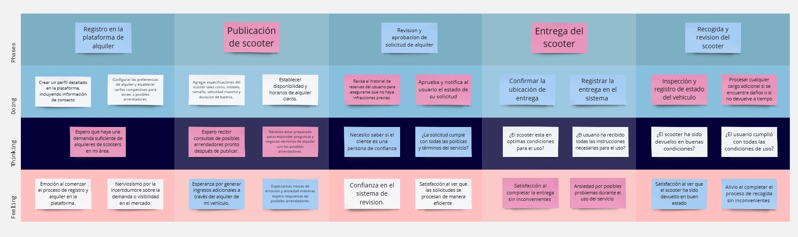
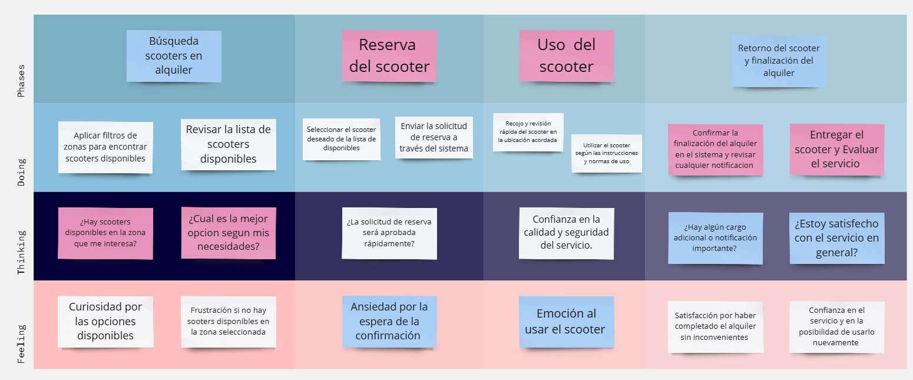
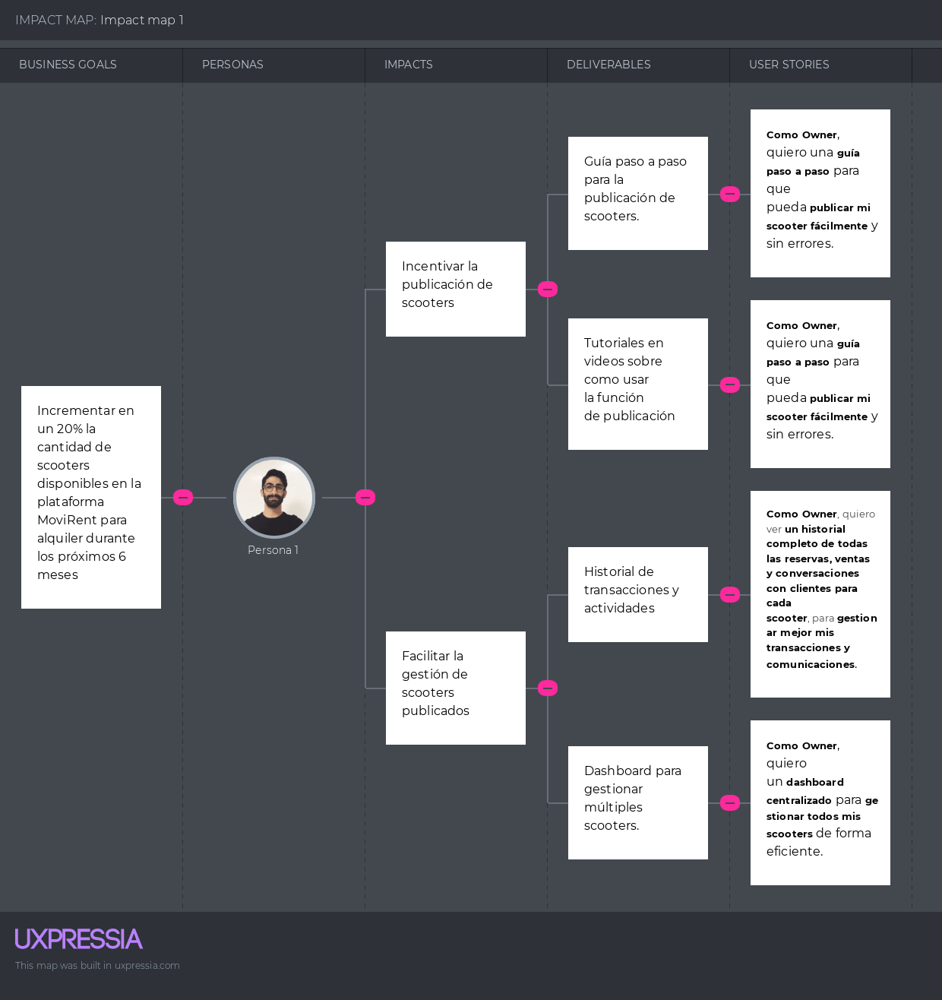

---
# Capítulo III: Requirements Specification
## 3.1. To-Be Scenario Mapping

Aquí se expone el análisis de los escenarios, organizando una tabla que detalla la situación que necesita ser optimizada para el segmento objetivo. Se examinan los pasos a seguir y se describe cómo se perciben. 

**Segmento 1: Owner**

**Segmento 2: User**

## 3.2. User Stories

<table >
    <tr>
        <th>Epic / Story ID</th>
        <th>Título</th>
        <th>Descripción</th>
        <th>Criterios de Aceptación</th>
        <th>Relacionado con (Epic ID)</th>
    </tr>
    <tr>
        <td>EP01</td>
        <td>Landing page para la aplicacion MoviRent</td>
        <td><b>Como</b> Owner/Cliente MoviRent <b>Quiero</b> ingresar una landing page <b>Para</b> informarme sobre la aplicación y su equipo de desarrollo.</td>
        <td>No corresponde</td>
        <td>No corresponde</td>
    </tr>
    <tr>
        <td>EP02</td>
        <td>Gestión de cuenta de usuario</td>
        <td><b>Como</b> Owner/Cliente de MoviRent <b>Quiero</b> crear, visualizar, eliminar y editar mi cuenta <b>Para</b> tener mis datos actualizados y comenzar a hacer uso de la aplicación correctamente.</td>
        <td>No corresponde</td>
        <td>No corresponde</td>
    </tr>
    <tr>
        <td>EP03</td>
        <td>Gestión de scooters en alquiler</td>
        <td><b>Como</b> Owner en MoviRent <b>Quiero</b> agregar y gestionar mis scooters <b>Para</b> asegurarme que estén disponibles y en buen estado para el alquiler.</td>
        <td>No corresponde</td>
        <td>No corresponde</td>
    </tr>
    <tr>
        <td>EP04</td>
        <td>Gestión de reservas</td>
        <td><b>Como</b> cliente de MoviRent <b>Quiero</b> gestionar mis reservas y el uso de scooters <b>Para</b> planificar y controlar mis alquileres. </td>
        <td>No corresponde</td>
        <td>No corresponde</td>
    </tr>
    <tr>
        <td>EP05</td>
        <td>Gestionar historial de reservas</td>
        <td><b>Cómo</b> Cliente de Movitech <b>Quiero</b> poder ver el historial completo de las reservas realizadas<b> Para</b> acceder a la información de estos de manera sencilla.
        <b>Y</b> tener un control de mi historial</td>
        <td>No corresponde</td>
        <td>No corresponde</td>
    </tr>
    <tr>
        <td>EP06</td>
        <td>Gestión de planes</td>
        <td><b>Cómo</b> cliente de MoviRent <b>Quiero</b> tener una gestión y control de mi plan <b>Para</b> poder adquirirlo y coancelarlo cuando lo requiera</td>
        <td>No corresponde</td>
        <td>No corresponde</td>
    </tr>
    <tr>
        <td>US01</td>
        <td>Implementación de la sección Inicio de la Landing Page</td>
        <td><b>Como</b> visitante de la landing page
        <b>Quiero</b> visualizar la sección "Inicio"
        <b>Para</b> tener una primera vista del producto</td>
        <td>
            <b>Scenario 1: Visualizar sección Inicio</b>  
            <b>Dado que</b> el visitante ingresa a la página 
            <b>Cuando</b> la página cargue  
            <b>Entonces</b> se muestra una sección llamativa que anime al usuario a usar la aplicación. 
             
            <b>Scenario 2: Error en el sistema </b>  
            <b>Dado que</b> el visitante se encuentre dentro de la landing page 
            <b>Cuando</b> ocurra algún problema con el sistema  
            <b>Entonces</b> no se muestra la sección Home 
            <b>Y</b> se muestra un mensaje de error. 
        <td>EP01</td>
    </tr>
    <tr>
        <td>US02</td>
        <td>Implementación de la sección "Sobre Nosotros" de la Landing Page</td>
        <td><b>Como</b> visitante de la landing page
        <b>Quiero</b> visualizar la sección "Sobre Nosotros"
        <b>Para</b> tener información de la startup CiberMach.</td>
        <td>
            <b>Scenario 1: Acceder a la sección "Sobre Nosotros"</b>  
            <b>Dado que</b> el visitante se encuentre dentro de la landing page  
            <b>Cuando</b> navegue hasta la sección “Sobre Nosotros”  
            <b>Entonces</b> se muestra información importante sobre la startup.  
             
            <b>Scenario 2: Error en el sistema </b>  
            <b>Dado que</b> el visitante se encuentre dentro de la landing page 
            <b>Cuando</b> ocurra algún problema con el sistema  
            <b>Entonces</b> no se muestra la sección Home 
            <b>Y</b> se muestra un mensaje de error. 
        <td>EP01</td>
    </tr>
    <tr>
        <td>US03</td>
        <td>Implementación de la sección "Servicios" de la Landing Page</td>
        <td><b>Como</b> visitante de la landing page
        <b>Quiero</b> visualizar la sección "Servicios"
        <b>Para</b> tener información de los servicios ofrecidos por la aplicación</td>
        <td>
            <b>Scenario 1: Acceder a la sección "Servicios"</b>  
            <b>Dado que</b> el visitante se encuentre dentro de la landing page 
            <b>Cuando</b> navegue hasta la sección “Servicios”  
            <b>Entonces</b> se muestra información sobre los servicios que ofrece MoviRent 
             
            <b>Scenario 2: Error en el sistema </b>  
            <b>Dado que</b> el visitante se encuentre dentro de la landing page 
            <b>Cuando</b> ocurra algún problema con el sistema  
            <b>Entonces</b> no se muestra la sección Home 
            <b>Y</b> se muestra un mensaje de error. 
        <td>EP01</td>
    </tr>
    <tr>
        <td>US04</td>
        <td>Implementación de la sección "Planes" de la Landing Page</td>
        <td><b>Como</b> visitante de la landing page
        <b>Quiero</b> visualizar la sección "Planes"
        <b>Para</b> tener información de las membresías de la aplicación</td>
        <td>
            <b>Scenario 1: Acceder a la sección "Planes"</b>  
            <b>Dado que</b> el visitante se encuentre dentro de la landing page 
            <b>Cuando</b> navegue hasta la sección “Planes”  
            <b>Entonces</b> se muestra la información relacionada a los planes de pago que se ofrecen y cuáles son los beneficios de cada uno de estos. 
             
            <b>Scenario 2: Error en el sistema </b>  
            <b>Dado que</b> el visitante se encuentre dentro de la landing page 
            <b>Cuando</b> ocurra algún problema con el sistema  
            <b>Entonces</b> no se muestra la sección Home 
            <b>Y</b> se muestra un mensaje de error. 
        <td>EP01</td>
    </tr>
    <tr>
        <td>US05</td>
        <td>Implementación de la sección "About the Team" de la Landing Page</td>
        <td><b>Como</b> visitante de la landing page
        <b>Quiero</b> visualizar la sección "About the Team"
        <b>Para</b> tener información de los miembros que conforman la startup.</td>
        <td>
            <b>Scenario 1: Conocer al equipo en "About the Team"</b>  
            <b>Dado que</b> el visitante se encuentre dentro de la landing page  
            <b>Cuando</b> navegue hasta la sección “About the Team” 
            <b>Entonces</b> se muestra la información correspondiente a los videos about the project y about the team, además de la información de cada uno de los miembros. 
             
            <b>Scenario 2: Error en el sistema </b>  
            <b>Dado que</b> el visitante se encuentre dentro de la landing page 
            <b>Cuando</b> ocurra algún problema con el sistema  
            <b>Entonces</b> no se muestra la sección Home 
            <b>Y</b> se muestra un mensaje de error. 
        <td>EP01</td>
    </tr>
    <tr>
        <td>US06</td>
        <td> Landing Page Responsiva a diferentes tamaños de pantalla </td>
        <td><b>Cómo</b> visitante interesado 
        <b>Quiero</b> que la landing page tenga un diseño responsivo
        <b>Para</b> acceder a ella desde cualquier dispositivo.</td>
        <td>
            <b>Scenario 1: Acceder a la landing page desde un ordenador</b>  
            <b>Dado que</b> el visitante se encuentre usando un ordenador de escritorio  
            <b>Cuando</b> ingrese a la landing page  
            <b>Entonces</b> se muestra la landing page adaptada correctamente a la pantalla del ordenador.  
             
            <b>Scenario 2: Acceder a la landing page desde un dispositivo móvil</b>  
            <b>Dado que</b> el visitante se encuentre usando un dispositivo móvil  
            <b>Cuando</b> ingrese a la landing page  
            <b>Entonces</b> se muestra la landing page adaptada correctamente a la pantalla del dispositivo móvil.  
        <td>EP01</td>
    </tr>
    <tr>
        <td>US07</td>
        <td>Acceder a la aplicación desde la landing page </td>
        <td><b>Cómo</b> visitante de la landing page 
        <b>Quiero</b> poder acceder a la aplicación MoviRent desde la landing page
        <b>Para</b> comenzar a utilizar las funcionalidades ofrecidas</td>
        <td>
            <b>Scenario 1: Usuario ingresa a aplicación</b>  
            <b>Dado que</b> el visitante se encuentra en la landing page  
            <b>Cuando</b> seleccione la opción que permite el acceso al software elaborado 
            <b>Entonces</b> es redirigido a la aplicación desplegada 
             
            <b>Scenario 2: Fallo en el acceso a la aplicación</b>  
            <b>Dado que</b> el visitante se encuentre en la landing page  
            <b>Cuando</b> seleccione la opción que permite el acceso al software elaborado y ocurra un error en el proceso de redirección 
            <b>Entonces</b> el usuario obtiene un mensaje de error. 
        <td>EP01</td>
    </tr>
    <tr>
        <td>US08</td>
        <td>Registrar usuario</td>
        <td><b>Cómo</b> visitante de la aplicación web de MoviRent
        <b>Quiero</b> poder crear una cuenta personal
        <b>Para</b> comenzar a hacer uso de la aplicación como Owner/Cliente.</td>
        <td>
            <b>Scenario 1: Usuario ingresa credenciales válidas.</b>  
            <b>Dado que</b> el visitante desee crear una cuenta personal en la aplicación MoviRent  
            <b>Cuando</b> ingrese las credenciales de una cuenta inexistente en la base de datos MoviRent, una contraseña que cumple con todos los requisitos de seguridad, su DNI real y acepte los términos y condiciones de uso  
            <b>Entonces</b> se creará la cuenta de usuario. 
             
            <b>Scenario 2: Usuario ingresa credenciales incorrectas.</b>  
            <b>Dado que</b> Usuario ingresa credenciales incorrectas.  
            <b>Cuando</b> ingrese una dirección de correo electrónico o contraseña o DNI que no cumplen con los requisitos especificados 
            <b>Entonces</b> se le denegará la operación 
        <td>EP02</td>
    </tr>
    <tr>
        <td>US09</td>
        <td>Iniciar sesión</td>
        <td><b>Cómo</b> Owner/Cliente de MoviRent 
        <b>Quiero</b> iniciar sesión
        <b>Para</b> acceder a los beneficios que ofrece la aplicación.</td>
        <td>
            <b>Scenario 1: Usuario ingresa credenciales válidas </b>  
            <b>Dado que</b> el usuario posee una cuenta en la aplicación MoviRent  <b>Y</b> desee iniciar sesión  
            <b>Cuando</b> ingrese las credenciales necesarias correctamente 
            <b>Entonces</b> el sistema permitirá el acceso a la aplicación 
             
            <b>Scenario 2: Usuario ingresa credenciales incorrectas</b>  
            <b>Dado que</b> el usuario posee una cuenta en la aplicación MoviRent  <b>Y</b> desea iniciar sesión  
            <b>Cuando</b> ingrese alguna credencial de manera incorrecta  
            <b>Entonces</b> el sistema denegará la solicitud 
        <td>EP02</td>
    </tr>
    <tr>
        <td>US10</td>
        <td>Visualizar perfil de usuario</td>
        <td><b>Cómo</b> Owner/Cliente de MoviRent 
        <b>Quiero</b> visualizar mi perfil personal 
        <b>Para</b> visualizar mis datos actuales</td>
        <td>
            <b>Scenario 1: Acceder al perfil personal</b>  
            <b>Dado que</b> el usuario desee visualizar su información personal  
            <b>Cuando</b>  ingrese a su perfil  
            <b>Entonces</b> obtendrá toda la información que registró previamente 
             
            <b>Scenario 2: Problema al acceder al perfil personal </b>  
            <b>Dado que</b> el usuario desee visualizar su información personal   
            <b>Cuando</b> intente ingresar a su perfil  <b>Y</b> experimente un error de conexión o de servidor  
            <b>Entonces</b> no se visualizarán los datos del perfil  
        <td>EP02</td>
    </tr>
    <tr>
        <td>US11</td>
        <td>Cambiar datos personales </td>
        <td><b>Cómo</b> Owner/Cliente de MoviRent 
        <b>Quiero</b> cambiar los datos asociados a mi perfil
        <b>Para</b> actualizar la información</td>
        <td>
            <b>Scenario 1: Cambiar contraseña</b>  
            <b>Dado que</b> el usuario quiera cambiar su contraseña  
            <b>Cuando</b> ingrese la nueva contraseña, esta sea validada por el sistema  <b>Y</b> el usuario confirme su intención de proceder con el cambio 
            <b>Entonces</b> la nueva clave será guardada y la información actualizada. 
             
            <b>Scenario 2: Cambiar nombre</b>  
            <b>Dado que</b> el usuario quiera cambiar su nombre 
            <b>Cuando</b> ingrese el nuevo nombre, esta sea validada por el usuario  <b>Y</b> confirme su intención de proceder con el cambio  
            <b>Entonces</b> el nuevo nombre será guardado y la información actualizada 
             
            <b>Scenario 3: Cambiar foto</b>  
            <b>Dado que</b> el usuario quiera cambiar su foto  
            <b>Cuando</b> ingrese la nueva foto, esta sea validada por el usuario  <b>Y</b> confirme su intención de proceder con el cambio 
            <b>Entonces</b> la nueva foto será guardada y la información actualizada 
             
            <b>Scenario 4: Cambiar número de celular</b>  
            <b>Dado que</b> el usuario quiera cambiar su número de celular  
            <b>Cuando</b> ingrese el nuevo número, esta sea validada por el sistema  <b>Y</b> el usuario confirme su intención de proceder con el cambio  
            <b>Entonces</b> el nuevo número será guardado y la información actualizada 
             
            <b>Scenario 5: Ingreso de datos inválidos</b>  
            <b>Dado que</b> el usuario quiera cambiar su información  
            <b>Cuando</b> ingrese datos inválidos 
            <b>Entonces</b> se mostrará un mensaje de dato no válido 
             
            <b>Scenario 6: No cambiar información</b>  
            <b>Dado que</b> el usuario no quiera cambiar su información  
            <b>Cuando</b> aparezca el pop up para confirmar el cambio  <b>Y</b> seleccione la opción para cancelar cambio 
            <b>Entonces</b> el pop up desaparecerá y el cambio no se realizará 
        <td>EP02</td>
    </tr>
    <tr>
        <td>US12</td>
        <td>Eliminar cuenta de usuario</td>
        <td><b>Cómo</b> Owner/Cliente de MoviRent 
        <b>Quiero</b> eliminar mi cuenta de usuario
        <b>Para</b> dejar de usar los servicios de la aplicación</td>
        <td>
            <b>Scenario 1: Owner/Cliente elimina cuenta de usuario </b>  
            <b>Dado que</b> el Owner/Cliente desee eliminar su cuenta de usuario  
            <b>Cuando</b> seleccione la opción de eliminar cuenta en su perfil  <b>Y</b> confirme su intención para proceder con la operación 
            <b>Entonces</b> el sistema eliminará la cuenta y todos los datos almacenados.  
             
            <b>Scenario 2: Owner/Cliente no elimina cuenta de usuario</b>  
            <b>Dado que</b> el Owner/Cliente desee eliminar su cuenta de usuario  
            <b>Cuando</b> niegue su intención para proceder con la operación 
            <b>Entonces</b> el sistema regresará a la vista de su cuenta sin eliminar los datos. 
        <td>EP02</td>
    </tr>
    <tr>
        <td>US13</td>
        <td>Publicar scooter en alquiler</td>
        <td><b>Cómo</b> Owner de un scooter eléctrico  
        <b>Quiero</b> crear publicaciones con la información y especificaciones de mi scooter
        <b>Para</b> que pueda ser alquilado por un cliente</td>
        <td>
            <b>Scenario 1: Owner publica su scooter en MoviRent </b>  
            <b>Dado que</b> el Owner cuente con una cuenta en nuestra aplicación  <b>Y</b> se encuentre el la opción de “Publicar scooter”  
            <b>Cuando</b> llene todas las casillas obligatorias para publicar su scooter  <b>Y</b> le de al botón “Publicar” 
            <b>Entonces</b> el sistema le muestra un aviso de que su scooter ha sido publicado.  
             
           <b>Scenario 2: Owner cancela la publicación de su scooter en MoviRent</b>  
            <b>Dado que</b> el Owner cuente con una cuenta en nuestra aplicación  <b>Y</b> se encuentre el la opción de “Publicar scooter”   
            <b>Cuando</b> le de al botón de “Cancelar” 
            <b>Entonces</b> el sistema le muestra un aviso de que se ha cancelado la publicación. 
             
           <b>Scenario 3: Owner no publica su scooter en MoviRent </b>  
            <b>Dado que</b> el Owner cuente con una cuenta en nuestra aplicación  <b>Y</b> se encuentre el la opción de “Publicar scooter”  
            <b>Cuando</b> no llene todas las casillas obligatorias para publicar su scooter  <b>Y</b> le de al botón “Publicar” 
            <b>Entonces</b> el sistema le muestra un aviso de que se no ha completado la información requerida  <b>Y</b> no se publica su scooter 
        <td>EP03</td>
    </tr>
    <tr>
        <td>US14</td>
        <td>Visualizar un scooter en alquiler</td>
        <td><b>Cómo</b> Owner de un scooter eléctrico 
        <b>Quiero</b> visualizar las publicaciones con la información y especificaciones de mi scooter
        <b>Para</b> verificar que toda la información ingresada es correcta y actualizada.</td>
        <td>
            <b>Scenario 1: Owner visualiza su scooter en MoviTech </b>  
            <b>Dado que</b> el Owner se encuentre en la aplicación de MoviRent  
            <b>Cuando</b> se dirija a la opción de “Ver mis scooters” 
            <b>Entonces</b> el sistema le mostrará la información de los scooters publicados. 
             
            <b>Scenario 2: Owner cancela la visualización de su scooter en MoviRent </b>  
            <b>Dado que</b> el Owner se encuentre en la aplicación de MoviRent 
            <b>Cuando</b> se dirija a la opción de “Ver mis scooters”  <b>Y</b> le de al botón de “Salir”  
            <b>Entonces</b> el sistema lo sacará de la ventana de “Ver mis scooters” 
        <td>EP03</td>
    </tr>
    <tr>
        <td>US15</td>
        <td>Editar Scooter en alquiler</td>
        <td><b>Cómo</b> Owner de un scooter eléctrico 
        <b>Quiero</b> editar la publicación de mi scooter
        <b>Para</b> que la información proporcionada a los clientes esté siempre actualizada.</td>
        <td>
            <b>Scenario 1: Owner edita la publicación de su scooter en MoviRent</b>  
            <b>Dado que</b> el Owner se encuentra en el apartado de “Mis scooters”  <b>Y</b> le de al botón “Editar” de una publicación.  
            <b>Cuando</b> actualice correctamente la información 
            <b>Entonces</b> el sistema le muestra un aviso de que su scooter ha sido actualizado 
             
            <b>Scenario 2: Owner cancela la edición de la publicación de su scooter en MoviRent</b>  
            <b>Dado que</b> el Owner se encuentra en el apartado de “Mis scooters”  <b>Y</b> le de al botón “Editar” de una publicación.  
            <b>Cuando</b> le de al botón de “Cancelar” 
            <b>Entonces</b> el sistema cierra la ventana de edición de publicación 
             
            <b>Scenario 3: Owner no edita la publicación de su scooter en MoviRent</b>  
            <b>Dado que</b> el Owner se encuentra en el apartado de “Mis scooters”  <b>Y</b> le de al botón “Editar” de una publicación.  
            <b>Cuando</b> ingrese incorrectamente la información  <b>Y</b> le de al botón de “Aceptar” 
            <b>Entonces</b> el sistema le muestra un aviso de que su scooter no ha sido actualizado. 
        <td>EP03</td>
    </tr>
    <tr>
        <td>US16</td>
        <td>Eliminar scooter en alquiler</td>
        <td><b>Cómo</b> Owner 
        <b>Quiero</b> eliminar un scooter en alquiler
        <b>Para</b> mantener la integridad de la información almacenada.</td>
        <td>
            <b>Scenario 1: Owner borra scooter en alquiler</b>  
            <b>Dado que</b> el Owner se encuentra en el apartado de “Mis scooters”  <b>Y</b> le de al botón “Eliminar” de una publicación.  
            <b>Cuando</b> confirme su intención de borrar los datos 
            <b>Entonces</b> el sistema eliminará de la base de datos toda la información almacenada de ese scooter 
             
            <b>Scenario 2: Owner decide no borrar scooter </b>  
            <b>Dado que</b> el Owner se encuentra en el apartado de “Mis scooters”  <b>Y</b> le de al botón “Eliminar” de una publicación. 
            <b>Cuando</b> o niegue su intención de borrar los datos  
            <b>Entonces</b> el sistema no eliminará la información del scooter.  
        <td>EP03</td>
    </tr>
    <tr>
        <td>US17</td>
        <td>Búsqueda de scooters cercano</td>
        <td><b>Cómo</b> cliente de MoviRent 
        <b>Quiero</b> poder buscar scooters disponibles en mi distrito
        <b>Para</b> facilitar mi desplazamiento.</td>
        <td>
            <b>Scenario 1: Búsqueda de scooters cercanos</b>  
            <b>Dado que</b> se encuentre en la sección de búsqueda de scooters  
            <b>Cuando</b> el usuario use un filtro por distrito  
            <b>Entonces</b> se mostrará en una lista al usuario los scooters cercanos 
             
            <b>Scenario 2: No encuentra disponibilidad</b>  
            <b>Dado que</b> el usuario use un filtro por distrito  <b>Y</b> no hay scooters disponibles en esa zona  
            <b>Cuando</b> el usuario realiza la búsqueda  
            <b>Entonces</b> se muestra un mensaje indicando que no hay scooters disponibles en la zona seleccionada en este momento. 
        <td>EP04</td>
    </tr>
    <tr>
        <td>US18</td>
        <td>Alquiler Scooter</td>
        <td><b>Cómo</b> Cliente de MoviRent
        <b>Quiero</b> alquilar un scooter
        <b>Para</b> llegar rápido a mi destino.</td>
        <td>
            <b>Scenario 1: Owner alquila un scooter en MoviRent</b>  
            <b>Dado que</b> el Cliente se encuentra en el apartado de “Scooters”  <b>Y</b> le de al botón “Ver detalles” de una publicación.  <b>Y</b> se dé al botón de “Alquilar”  
            <b>Cuando</b> el sistema le muestre la ventana de pago  <b>Y</b> se complete la información requerida  
            <b>Entonces</b> el sistema le mostrará un aviso de que el scooter ha sido alquilado con éxito y que puede ir a recogerlo para su uso. 
             
            <b>Scenario 2: Owner cancela el alquiler de un scooter en MoviRent </b>  
            <b>Dado que</b> el Cliente se encuentra en el apartado de “Scooters”  <b>Y</b> le de al botón “Ver detalles”de una publicación  <b>Y</b> se dé al botón de “Alquilar”  
            <b>Cuando</b> el sistema le muestre la ventana de pago  <b>Y</b> le de al botón de “Cancelar”  
            <b>Entonces</b> el sistema le mostrará un aviso de que se ha cancelado la operación 
             
            <b>Scenario 3: Owner no alquila un scooter en MoviRent</b>  
            <b>Dado que</b> el Cliente se encuentra en el apartado de “Scooters”  <b>Y</b> le de al botón “Ver detalles” de una publicación  <b>Y</b> se dé al botón de “Alquilar” 
            <b>Cuando</b> el sistema le muestre la ventana de pago  <b>Y</b> no se complete la información requerida 
            <b>Entonces</b> el sistema le mostrará un aviso de que no se ha podido proceder con el pago. 
        <td>EP04</td>
    </tr>
    <tr>
        <td>US19</td>
        <td>Calificación y reseñas</td>
        <td><b>Cómo</b> cliente de MoviRent
        <b>Quiero</b> poder calificar y dejar reseñas sobre mi experiencia con scooters utilizados y la zona donde los tomé
        <b>Para</b> ayudar a otros usuarios a tomar decisiones informadas.</td>
        <td>
            <b>Scenario 1: Calificación y reseñas </b>  
            <b>Dado que</b> el usuario tenga una cuenta registrada en la página web  <b>Y</b> haya utilizado un vehículo recientemente  
            <b>Cuando</b> el usuario acceda a la opción de dejar reseña  <b>Y</b> seleccione la zona o tipo de scooter donde quiera dejar su reseña  <b>Y</b> escriba su reseña  <b>Y</b> haga clic en publicar  
            <b>Entonces</b> se creará la reseña del usuario  <b>Y</b> será visible para otros usuarios.  
             
            <b>Scenario 2: Ver reseñas de otros clientes </b>  
            <b>Dado que</b> el usuario esté viendo las reseñas de otros usuarios sobre un scooter o una zona específica 
            <b>Cuando</b> el usuario busque reseñas  
            <b>Entonces</b> se mostrarán las calificaciones promedio y las reseñas de otros usuarios para ayudar al usuario a tomar una decisión informada sobre su experiencia.  
        <td>EP04</td>
    </tr>
    <tr>
        <td>US20</td>
        <td>Visualizar historial de scooters alquilados</td>
        <td><b>Cómo</b> Cliente de MoviRent
        <b>Quiero</b> visualizar mi historial de scooters alquilados
        <b>Para</b> acceder fácilmente a su información</td>
        <td>
            <b>Scenario 1: Cliente visualiza su historial de scooters alquilados </b>  
            <b>Dado que</b> el Cliente se encuentre en la aplicación de MoviRent  <b>Y</b> ya ha alquilado scooters anteriormente 
            <b>Cuando</b> se dirija a la opción de “Ver historial” 
            <b>Entonces</b> el sistema le mostrará la información de los scooters que alquiló anteriormente. 
             
            <b>Scenario 2: Cliente no visualiza su historial de scooters alquilados</b>  
            <b>Dado que</b> el Cliente se encuentre en la aplicación de MoviRent  <b>Y</b> no ha alquilado scooters anteriormente  
            <b>Cuando</b> se dirija a la opción de “Ver historial” 
            <b>Entonces</b> el sistema mostrará un mensaje de que aún no ha alquilado ningún scooter.  
        <td>EP05</td>
    </tr>
    <tr>
        <td>US21</td>
        <td>Borrar historial de scooters alquilados</td>
        <td><b>Cómo</b> Cliente de MoviRent
        <b>Quiero</b> o borrar mi historial de scooters alquilados
        <b>Para</b> ya no tener información que considere innecesaria. </td>
        <td>
            <b>Scenario 1: Cliente elimina su historial de scooters alquilados</b>  
            <b>Dado que</b> el Cliente se encuentre en la aplicación de MoviRent  <b>Y</b> ya ha alquilado scooters anteriormente  
            <b>Cuando</b> se dirija a la opción de “Ver historial”  <b>Y</b> le de al botón de “Borrar historial”  <b>Y</b> confirme la acción 
            <b>Entonces</b> el sistema le mostrará un mensaje de que su historial ha sido borrado  <b>Y</b> ya no mostrará la información del historial 
             
            <b>Scenario 2: Cliente no elimina su historial de scooters alquilados</b>  
            <b>Dado que</b> el Cliente se encuentre en la aplicación de MoviRent  <b>Y</b> ya ha alquilado scooters anteriormente  
            <b>Cuando</b> se dirija a la opción de “Ver historial”  <b>Y</b> le de al botón de “Borrar historial”  <b>Y</b> cancele la acción.  
            <b>Entonces</b> el sistema le mostrará un mensaje de que su historial no ha sido borrado  <b>Y</b> seguirá mostrando la información del historial. 
        <td>EP05</td>
    </tr>
    <tr>
        <td>US22</td>
        <td>Adquirir plan</td>
        <td><b>Cómo</b> Cliente de MoviRent 
        <b>Quiero</b> Comprar un plan
        <b>Para</b> acceder a sus beneficios al usar la aplicación. </td>
        <td>
            <b>Scenario 1: Cliente compra una membresía en MoviTech </b>  
            <b>Dado que</b> el Cliente se encuentra en el apartado de “Membresía”  <b>Y</b> el Cliente no cuente con una membresía  <b>Y</b> le de al botón “Subscribe” de una membresía.  
            <b>Cuando</b> el sistema le muestre la ventana de pago  <b>Y</b> se complete la información requerida  
            <b>Entonces</b> el sistema le mostrará un aviso de que la membresía se ha comprado con éxito.  
             
            <b>Scenario 2: Cliente cancela compra una membresía en MoviRent </b>  
            <b>Dado que</b> el Cliente se encuentra en el apartado de “Membresía”  <b>Y</b> el Cliente no cuente con una membresía  <b>Y</b> le de al botón “Subscribe” de una membresía.  
            <b>Cuando</b> el sistema le muestre la ventana de pago  <b>Y</b> se dé al botón de cancelar 
            <b>Entonces</b> el sistema le mostrará un aviso de que se ha cancelado la compra de la membresía 
             
            <b>Scenario 3: Cliente no compra una membresía en MoviRent</b>  
            <b>Dado que</b> el Cliente se encuentra en el apartado de “Membresía” Y le de al botón “Subscribe” de una membresía  <b>Y</b> el Cliente no cuente con una membresía  
            <b>Cuando</b> el sistema le muestre la ventana de pago  <b>Y</b> no se complete la información requerida  
            <b>Entonces</b> el sistema le mostrará un aviso de que la membresía no se ha adquirido 
             
            <b>Scenario 4: Cliente cambia de membresía en MoviRent</b>  
            <b>Dado que</b> el Cliente se encuentra en el apartado de “Membresía”  <b>Y</b> el Cliente cuente con una membresía  <b>Y</b> le de al botón “Subscribe” de una membresía  <b>Y</b> seleccione otra membresia diferente  
            <b>Cuando</b> el sistema le muestre la ventana de pago  <b>Y</b> se complete la información requerida 
            <b>Entonces</b> el sistema le mostrará un aviso de que la membresía se ha comprado con éxito 
        <td>EP06</td>
    </tr>
    <tr>
        <td>US23</td>
        <td>Cancelar suscripción </td>
        <td><b>Cómo</b> Cliente de MoviRent
        <b>Quiero</b> cancelar mi suscripción
        <b>Para</b> ya no seguir teniendo cobros de esta. </td>
        <td>
            <b>Scenario 1: Cliente cancela una membresía en MoviRent</b>  
            <b>Dado que</b> el Cliente se encuentra en el apartado de “Membresía”  <b>Y</b> el Cliente cuente con una membresía  <b>Y</b> le de al botón “Cancelar Membresía” de una membresía.  
            <b>Cuando</b> el sistema le muestre la ventana de cancelación  <b>Y</b> se confirme la acción 
            <b>Entonces</b> el sistema le mostrará un aviso de que la membresía se ha cancelado con éxito. 
             
            <b>Scenario 2: Cliente no cancela una membresía en MoviTech</b>  
            <b>Dado que</b> el Cliente se encuentra en el apartado de “Membresía”  <b>Y</b> el Cliente cuente con una membresía  <b>Y</b> le de al botón “Cancelar Membresía” de una membresía. 
            <b>Cuando</b> el sistema le muestre la ventana de cancelación  <b>Y</b> no confirme la acción 
            <b>Entonces</b> el sistema le mostrará un aviso de que la membresía no se ha cancelado. 
        <td>EP06</td>
    </tr>
</table>

## 3.3. Impact Mapping

En este apartado se muestra los impact mapping de nuestros segmentos objetivos:

**Segmento 1: Owner**

![ImpactMappingOwner]

**Segmento 2: User**

## 3.4. Product Backlog    
        
<table border="1px" style="text-align: center; width: 100%;">
<tr>
    <td valign="top"> #Orden </td>
    <td valign="top"> User Story Id </td>
    <td valign="top"> Título </td>
    <td valign="top"> Descripción </td>
    <td valign="top"> StoryPoints (1/2/3/5/8 </td>
  </tr>
    <tr>
    <td valign="top"> 01 </td>
    <td valign="top"> US01 </td>
    <td valign="top"> Implementación de la sección "Inicio" de la Landing Page </td>
    <td valign="top"> Como visitante de la landing page Quiero visualizar la sección "Inicio" Para tener una primera vista del producto.</td>
    <td valign="top"> 3 </td>
  </tr>
  <tr>
    <td valign="top"> 02 </td>
    <td valign="top"> US02 </td>
    <td valign="top"> Implementación de la sección "Sobre nosotros" de la Landing Page </td>
    <td valign="top"> Como visitante de la landing page Quiero visualizar la sección "Sobre nosotros" Para tener información de la startup CiberMach.</td>
    <td valign="top"> 1 </td>
  </tr>
  <tr>
    <td valign="top"> 03 </td>
    <td valign="top"> US03 </td>
    <td valign="top"> Implementación de la sección "Servicios" de la Landing Page </td>
    <td valign="top"> Como visitante de la landing page Quiero visualizar la sección "Servicios" Para tener información de los servicios ofrecidos por la aplicación.</td>
    <td valign="top"> 3 </td>
  </tr>
  <tr>
    <td valign="top"> 04 </td>
    <td valign="top"> US04 </td>
    <td valign="top"> Implementación de la sección "Planes" de la Landing Page </td>
    <td valign="top"> Como visitante de la landing page Quiero visualizar la sección "Planes" Para tener información de las membresías de la aplicación</td>
    <td valign="top"> 3 </td>
  </tr>
<tr>
    <td valign="top"> 05 </td>
    <td valign="top"> US05 </td>
    <td valign="top"> Implementación de la sección "About the Team" de la Landing Page </td>
    <td valign="top"> Como visitante de la landing page Quiero visualizar la sección "About the Team" Para tener información de los miembros que conforman la startup.</td>
    <td valign="top"> 3 </td>
  </tr>
  <tr>
    <td valign="top"> 06 </td>
    <td valign="top"> US06 </td>
    <td valign="top"> Landing Page Responsiva a diferentes tamaños de pantalla</td>
    <td valign="top"> Como visitante interesado Quiero que la landing page tenga un diseño responsivo Para acceder a ella desde cualquier dispositivo.</td>
    <td valign="top"> 5 </td>
  </tr>
  <tr>
    <td valign="top"> 07 </td>
    <td valign="top"> US07 </td>
    <td valign="top"> Acceder a la aplicación desde la landing page </td>
    <td valign="top"> Cómo visitante de la landing page Quiero poder acceder a la aplicación MoviRent desde la landing page Para comenzar a utilizar las funcionalidades ofrecidas </td>
    <td valign="top"> 3 </td>
  </tr>
  <tr>
    <td valign="top"> 08 </td>
    <td valign="top"> US08 </td>
    <td valign="top"> Registrar usuario </td>
    <td valign="top"> Cómo visitante de la aplicación web de MoviRent Quiero poder crear una cuenta personal Para comenzar a hacer uso de la aplicación como Owner/Cliente. </td>
    <td valign="top"> 3 </td>
  </tr>
  <tr>
    <td valign="top"> 09 </td>
    <td valign="top"> US09 </td>
    <td valign="top"> Iniciar sesión </td>
    <td valign="top"> Cómo Owner/Cliente de MoviRent Quiero iniciar sesión Para acceder a los beneficios que ofrece la aplicación.</td>
    <td valign="top"> 5 </td>
  </tr>
  <tr>
    <td valign="top"> 10 </td>
    <td valign="top"> US10 </td>
    <td valign="top"> Visualizar perfil de usuario </td>
    <td valign="top"> Cómo Owner/Cliente de MoviRent Quiero visualizar mi perfil personal Para visualizar mis datos actuales.</td>
    <td valign="top"> 5 </td>
  </tr>
  <tr>
    <td valign="top"> 11 </td>
    <td valign="top"> US11 </td>
    <td valign="top"> Cambiar datos personales </td>
    <td valign="top"> Cómo Owner/Cliente de MoviRent Quiero cambiar los datos asociados a mi perfil Para actualizar la información. </td>
    <td valign="top"> 3 </td>
  </tr>
  <tr>
    <td valign="top"> 12 </td>
    <td valign="top"> US12 </td>
    <td valign="top"> Eliminar cuenta de usuario </td>
    <td valign="top"> Cómo Owner/Cliente de MoviRent Quiero eliminar mi cuenta de usuario Para dejar de usar los servicios de la aplicación. </td>
    <td valign="top"> 3 </td>
  </tr>
  <tr>
    <td valign="top"> 13 </td>
    <td valign="top"> US13 </td>
    <td valign="top"> Publicar scooter en alquiler </td>
    <td valign="top"> Cómo Owner de un scooter eléctrico Quiero crear publicaciones con la información y especificaciones de mi scooter Para que pueda ser alquilado por un cliente. </td>
    <td valign="top"> 5 </td>
  </tr>
  <tr>
    <td valign="top"> 14 </td>
    <td valign="top"> US14 </td>
    <td valign="top"> Visualizar un scooter en alquiler </td>
    <td valign="top"> Cómo Owner de un scooter eléctrico Quiero visualizar las publicaciones con la información y especificaciones de mi scooter Para verificar que toda la información ingresada es correcta y actualizada.</td>
    <td valign="top"> 3 </td>
  </tr>
  <tr>
    <td valign="top"> 15 </td>
    <td valign="top"> US15 </td>
    <td valign="top"> Editar Scooter en alquiler </td>
    <td valign="top"> Cómo Owner de un scooter eléctrico Quiero editar la publicación de mi scooter Para que la información proporcionada a los clientes esté siempre actualizada. </td>
    <td valign="top"> 3 </td>
  </tr>
  <tr>
    <td valign="top"> 16 </td>
    <td valign="top"> US16 </td>
    <td valign="top"> Eliminar scooter en alquiler </td>
    <td valign="top"> Cómo Owner Quiero eliminar un scooter en alquiler Para mantener la integridad de la información almacenada. </td>
    <td valign="top"> 3 </td>
  </tr>
    <tr>
    <td valign="top"> 17 </td>
    <td valign="top"> US17 </td>
    <td valign="top"> Búsqueda de scooters cercano </td>
    <td valign="top"> Cómo cliente de MoviRent Quiero poder buscar scooters disponibles en mi distrito Para facilitar mi desplazamiento. </td>
    <td valign="top"> 8 </td>
  </tr>
      <tr>   
  <tr>
    <td valign="top"> 18 </td>
    <td valign="top"> US18 </td>
    <td valign="top"> Alquiler Scooter </td>
    <td valign="top"> Cómo Cliente de MoviRent Quiero alquilar un scooter Para llegar rápido a mi destino.</td>
    <td valign="top"> 5 </td>
  </tr>
   <tr>
    <td valign="top"> 19 </td>
    <td valign="top"> US19 </td>
    <td valign="top"> Calificación y reseñas </td>
    <td valign="top"> Cómo cliente de MoviRent Quiero poder calificar y dejar reseñas sobre mi experiencia con scooters utilizados y la zona donde los tomé Para ayudar a otros usuarios a tomar decisiones informadas.</td>
    <td valign="top"> 3 </td>
  </tr>
  <tr>
    <td valign="top"> 20 </td>
    <td valign="top"> US20 </td>
    <td valign="top"> Visualizar historial de scooters alquilados </td>
    <td valign="top"> Cómo Cliente de MoviRent Quiero visualizar mi historial de scooters alquilados Para acceder fácilmente a su información. </td>
    <td valign="top"> 5 </td>
  </tr>
      <tr>
    <td valign="top"> 21 </td>
    <td valign="top"> US21 </td>
    <td valign="top"> Borrar historial de scooters alquilados </td>
    <td valign="top"> Cómo Cliente de MoviRent Quiero o borrar mi historial de scooters alquilados Para ya no tener información que considere innecesaria.</td>
    <td valign="top"> 3 </td>
  </tr>
      <tr>
    <td valign="top"> 22 </td>
    <td valign="top"> US22 </td>
    <td valign="top"> Adquirir plan </td>
    <td valign="top"> Cómo Cliente de MoviRent Quiero Comprar un plan Para acceder a sus beneficios al usar la aplicación.</td>
    <td valign="top"> 5 </td>
  </tr>
      <tr>
    <td valign="top"> 23 </td>
    <td valign="top"> US23 </td>
    <td valign="top"> Cancelar suscripción </td>
    <td valign="top"> Cómo Cliente de MoviRent Quiero cancelar mi suscripción Para ya no seguir teniendo cobros de esta.</td>
    <td valign="top"> 3 </td>
  </tr>
      

</table>

---
