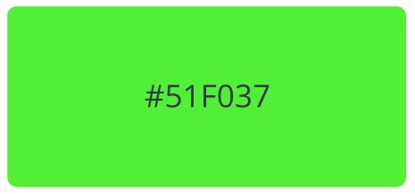
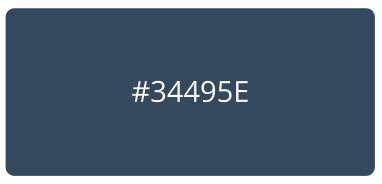
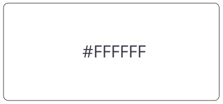

# Capítulo IV: Product Design
## 4.1. Style Guidelines
### 4.1.1. General Style Guidelines
Es fundamental considerar las decisiones y elementos visuales que respaldan los principios generales
de diseño para MoviRent. Por esta razón, resulta esencial definir aspectos clave como la identidad
de marca, la paleta de colores y la tipografía. Además, es necesario establecer el tono de comunicación
y el lenguaje utilizado, que abarcan características como divertido o serio, formal o casual, respetuoso
o irreverente, y entusiasta o sereno. Nuestro prototipo web integrará ciertos ajustes de colores, fuente 
de letra o tipografía y creación de un diseño estructural de la plataforma.
El color verde limon de nuestro logo que tiene como representación de la naturaleza, este color fue seleccionado para 
fomentar el transporte ecológico en nuestra ciudad. 
La tipografía que aplicamos en nuestro prototipo es Open Sans, por su legibilidad textual.

### 4.1.2. Web Style Guidelines 

- **Color primario:**
El color verde lima se adapta bien a nuestro modelo de negocio, ya que, al ser una aplicación 
enfocado de fomentar vehiculos ecológicos nos motiva seleccionar el dicho color, queremos que nuestro 
público objetivo se asocie a la imaginación, la diversidad y la creatividad.

  

- **Color secundario:** El color azul grisáceo oscuro como color secundario. 

  

- **Color de fondo:** El color blanco como color de fondo.

  

## 4.2. Information Architecture
### 4.2.1. Organization Systems

- **Jerarquía Visual:**

Con el propósito de mantener la estética de nuestra plataforma interactiva y a la vanguardia de
la competencia actual, hemos decidido priorizar la interfaz según importancia para facilitar la
interacción con el usuario.

- **Jerarquía de Tipografía:**

Nuestra plataforma difunde información que es recibida por nuestros usuarios con un orden
específico según la demanda. Por lo tanto, es importante tener en cuenta las características
con las que se generan nuestros títulos, subtítulos, párrafos, entre otros.

- **Alineación:**

En nuestra plataforma, nuestras imágenes y botones se encuentran alineados siempre de
manera vertical y horizontal. Permitiendo así agrupar varios objetos de diversos tipos con la
misma información.

- **Color y Contraste:**
A la vista de nuestros segmentos objetivos, el color cumple un rol muy importante en nuestra aplicación, promueve
las correctas composiciones del color, para dirigir diversas emociones y del contraste para
enfatizar aquellos objetos de mayor importancia.

- **Organización Secuencial:**

Además, los métodos de almacenamiento sobre los registros que el usuario final emplea
siguen una organización secuencial, esto con el objetivo de mejorar la simplicidad y la
rapidez con la que se almacenan y acceden a ellos. En el caso de nuestro proyecto
organizaremos se visualizarán la lista de Scooter para los User mientras.

- **Esquemas de categorización de contenido de nuestra web:**

Para el caso de organización visual utilizaremos el sistema jerárquico, lo que nos permitirá resaltar los componentes 
a los que deseamos que el usuario preste mayor atención. Esto dirigirá la atención del usuario a componentes de 
suma importancia como son: "Inicio", "Sobre Nosotros", "Servicios", "Planes", "Team" y "Empieza Ya!".
Para el proceso de reservas de scooters haremos uso de la organización secuencial:
- Solicitud de reserva (clientes):
  - Búsqueda de scooter.
  - Elección del scooter.
  - Solicitud de reserva.
  - Entrega del scooter.
  - Devolución del scooter.

- Solicitud de la inscripción de scooters (owner):
  - Inscripción de scooter a la plataforma.
  - Establecer tarifa y disponibilidad del scooter.
  - Publicar disponibilidad del scooter.

Para los esquemas de organización utilizaremos los siguientes tipos:
- Organización por orden cronológico para el historial de reservas de los clientes.
- Organización por orden alfabético para la sección “Mis scooters” del Owner.

### 4.2.2. Labeling Systems
Para el uso de etiquetas de nuestro landing page, se ha elegido un lenguaje sencillo lo que permite a los usuarios 
familiarizarse con facilidad a las opciones proporcionadas. Esto logrará que los usuarios puedan navegar de manera 
intuitiva.

En el Landing Page visualizará los siguientes botones de navegación:

<table style="text-align: center; width: 100%; border:1px">
	<tbody>
		<tr>
			<td>Etiqueta</td>
			<td>Descripción</td>
		</tr>
		<tr>
			<td>Inicio</td>
			<td>Apartado donde se muestra la información de la aplicación explicando sus características.</td>
		</tr>
		<tr>
			<td>Sobre Nosotros</td>
			<td>Apartado donde se informa al usuario sobre el equipo y el propósito.</td>
		</tr>
		<tr>
			<td>Servicios</td>
			<td>Apartado donde se muestra el tipo de usuario que puede ser y sus ventajas.</td>
		</tr>
		<tr>
			<td>Planes</td>
			<td>Apartado donde se muestran todos los planes de suscripción.</td>
		</tr>
		<tr>
			<td>Team</td>
			<td>Apartado donde el usuario puede comunicarse con nosotros.</td>
		</tr>
		<tr>
			<td>Empieza Ya!</td>
			<td>Apartado redirigir ir a la aplicación web.</td>
		</tr>
	</tbody>
</table>

Para la página es importante, un sistema de etiquetado efectivo para permitir que los usuarios encuentren fácilmente la 
información y los servicios que necesitan. Nuestro sistema de etiquetado considera cuidadosamente cómo presentar la 
información en el sitio web. Después de establecer la organización visual y los esquemas de categorización del contenido, 
se elegirá etiquetas claras y concisas que reflejan el lenguaje común y la comprensión del usuario con palabras comunes 
no pasan de tres palabras. Nos aseguraremos de utilizar etiquetas intuitivas y fáciles de recordar para representar los 
diferentes conjuntos de información y asociaciones entre ellos. También se utilizarán diferentes colores y diseños para 
resaltar y diferenciar las etiquetas y conjuntos de información en mi sitio web. Para evitar confusiones y asegurar la 
coherencia visual en todo el sitio web, se mantendrá un sistema de etiquetado consistente y se evitará el uso de términos 
técnicos o jerga que podría ser confuso para los usuarios.

En el parte superior derecho del home page contando con tres botones: 
- Sobre Nosotros: Muestra quiénes somos, nuestro propósito y equipo.
- Servicios: Muestra lo que ofrecemos al usuario para mejorar financieramente.
- Planes: Muestra el plan que quiere adquirir lo cual le llevará a registrarse.
- Team: Muestra el equipo detrás de la aplicación.
- Empieza Ya!: Muestra el botón para redirigir al usuario a la aplicación web.

### 4.2.3. SEO Tags and Meta Tags
### 4.2.4. Searching Systems
En esta sección, implementaremos dos métodos para mejorar la experiencia de búsqueda de nuestros usuarios. Se utilizará un sistema de búsqueda por texto que permitirá a los usuarios encontrar su vehículo de manera más rápida y personalizada.
Además, se incluirán filtros para refinar las búsquedas de la siguiente manera:

**Filtros Disponibles:**  
- Marca del Scooter: Se proporcionarán opciones de filtrado por marca de Scooter para permitir a nuestros usuarios buscar específicamente dentro de una marca deseada.
- Disponibilidad de Ubicación: Este filtro permitirá a los usuarios buscar vehículos disponibles en ubicaciones específicas, lo que será útil para aquellos que deseen encontrar opciones cercanas a ellos.

Con la implementación de estos sistemas de búsqueda y filtros, esperamos mejorar significativamente la experiencia de nuestros usuarios al encontrar el vehículo perfecto para sus necesidades.

### 4.2.5. Navigation Systems
Como sistema de navegación optamos emplear una barra de menú horizontal que guiará al usuario por las diferentes secciones con títulos claves y estáticos, esto facilitará al usuario a tener todas las herramientas a la mano y así disfrutar de una mejor navegación. Nuestra barra de menú contará con las siguientes secciones:
- Sobre Nosotros: El usuario podrá visualizar a qué se dedica nuestra Startup, su misión y visión.
- Servicios: El usuario podrá visualizar los servicios que estamos ofreciendo, si en caso quiera ser un Owner o un Client.
- Planes: Aquí podrá obtener toda la información de los planes que la aplicación le ofrece.
- Team: El usuario podrá visualizar al equipo detrás de esta aplicación web.
- Contáctanos: Donde los usuarios a través de un formulario podrán ponerse en contacto con nosotros.
  
## 4.3. Landing Page UI Design
### 4.3.1. Landing Page Wireframe
### 4.3.2. Landing Page Mock-up
## 4.4. Web Applications UX/UI Design
### 4.4.1. Web Applications Wireframes
### 4.4.2. Web Applications Wireflow Diagrams
### 4.4.3. Web Applications Mock-ups
### 4.4.4. Web Applications User Flow Diagrams
## 4.5. Web Applications Prototyping
## 4.6. Domain-Driven Software Architecture
### 4.6.1. Software Architecture Context Diagram

### 4.6.2. Software Architecture Container Diagrams

### 4.6.3. Software Architecture Components Diagrams
## 4.7. Software Object-Oriented Design
### 4.7.1. Class Diagrams
### 4.7.2. Class Dictionary
## 4.8. Database Design
### 4.8.1. Database Diagram
Para desarrollar la estructura de diagrama de base de datos usamos la herramienta de Vertabelo. A continuación, muestra las tabla de diseño de base de datos.

---
