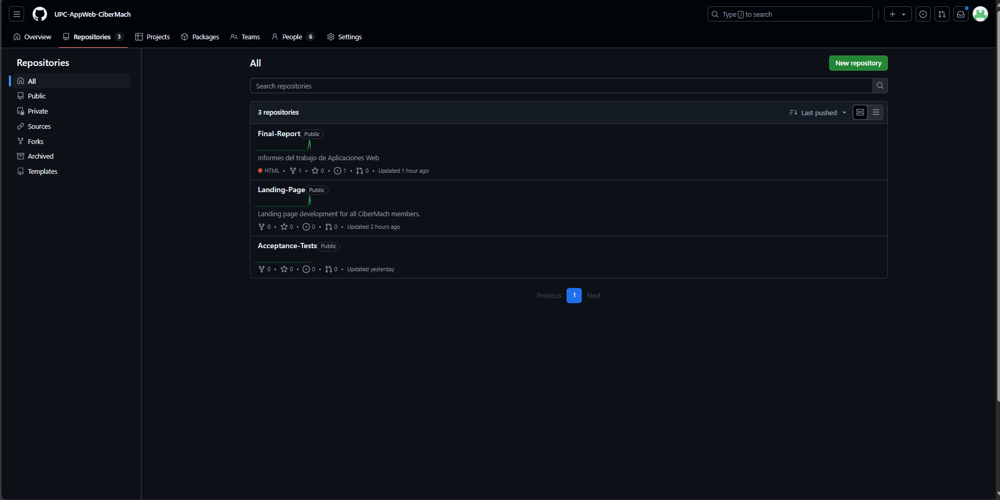
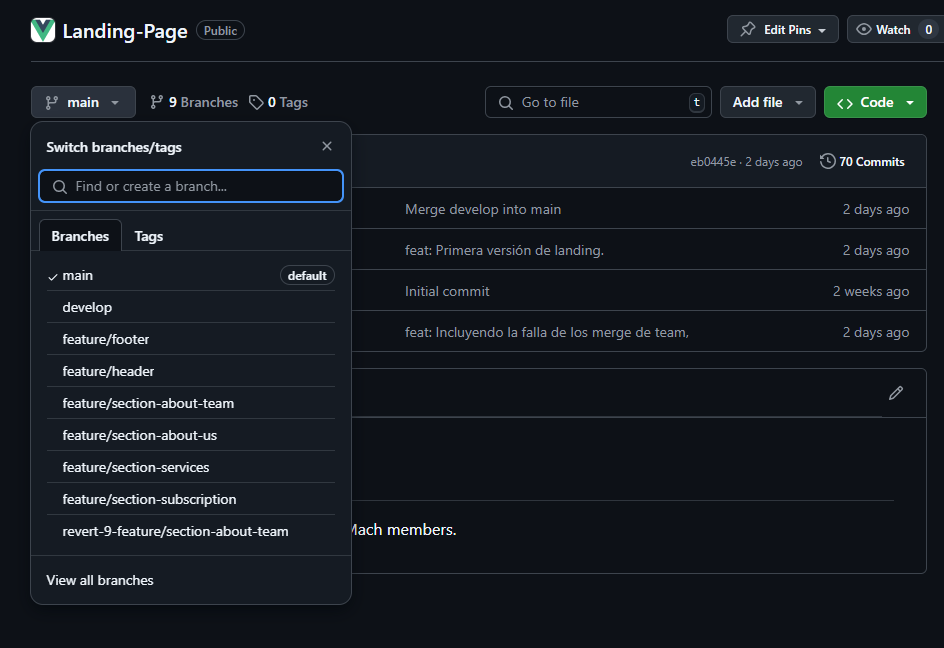

---

# Capítulo V: Product Implementation, Validation & Deployment
## 5.1. Software Configuration Management
### 5.1.1. Software Development Environment Configuration
En este apartado, se mencionarán los distintos productos de software empleados por el equipo de desarrollo, para llevar acabo las actividades relacionadas con la elaboración del proyecto.

 

**Project Management**

Google Meet (https://meet.google.com/): Google Meet es una plataforma de videoconferencias que permite realizar reuniones a distancia, facilitando la comunicación entre los integrantes del proyecto.  
 

**Requirements Managements**

Trello (https://trello.com/): Es un software de gestión de proyectos, que facilita asignar y organizar las tareas a realizar. Fue utilizado para el Product Backlog.  
 

**Product UX/UI Design** 

UXPressia (https://uxpressia.com/): Es una herramienta en línea que permite a los equipos de trabajo identificar y comprender los problemas, necesidades y comportamiento del usuario en relación a la solución de software que se está desarrollando, con el uso de plantillas. Se utilizó para la elaboración de los User Personas, Empathy Maps, Journey Maps e Impact Maps.

Figma (https://www.figma.com/): Figma es una herramienta de edición gráfica, en donde se puede diseñar y prototipar páginas web y aplicaciones de manera colaborativa en tiempo real. Se usó para realizar los wireframes, mock-ups y los desktop and mobile application prototype del proyecto.

Miro (https://miro.com/): Es una plataforma colaborativa el cual permite crear y usar pizarras digitales personalizadas en tiempo real. Miro cuenta con distintas herramientas y plantillas para la elaboración de mapeos, diagramas, flujos de trabajo, etc. Se utilizó para la realización de los As-Is y Tob-Be Scenario Maps.  
 

**Software Development**  

Landing Page: Para la creación de la landing page, se utilizaron las tecnologías base del desarrollo web: HTML5, CSS3 y JavaScript.  

GitHub (https://github.com/): Esta es una plataforma digital donde se pueden alojar proyectos mediante repositorios, los cuales utilizan un sistema de control de versiones llamado Git. GitHub nos permite trabajar colaborativamente y tener un seguimiento detallado de los avances en el proyecto. 

Git (https://git-scm.com/): Este es un software de control de versiones el cual se instala localmente y nos permite tener un historial de cambios que se realizan en el proyecto mediante commits. También se utiliza para trabajar colaborativamente en repositorios que se encuentran subidos en GitHub. 

WebStorm: Este es un entorno de desarrollo, el cual nos permite trabajar con HTML, CSS, Javascript y con frameworks como Vue y Angular.

Rider: Este es un entorno de desarrollo, el cual nos permite trabajar con el lenguaje C# y la plataforma .NET que nos permite crear diferentes tipos de aplicaciones, ya sean móvil, web o de escritorio. En nuestro caso, usaremos ASP .NET para crear un Web Service para nuestro proyecto.  
 

**Software Deployment**  

Netlify (https://www.netlify.com/): Netlify es una plataforma de despliegue de páginas y aplicaciones web, integrandose con repositorios en Git. Se usó para hospedar la landing page del proyecto.  
 
GitHub Page (https://pages.github.com/): GitHub Pages es un servicio que ofrece GitHub para publicar un sitio web a partir de un repositorio, cabe destacar que solo permite alojar sitios web estáticos y dinamicos. Se utilizó para desplegar la landing page del proyecto.
 

**Software Documentation**  

Vertabelo (https://vertabelo.com/): Es una herramienta online que facilita el diseño, creación y gestión de bases de datos de manera colaborativa. Se usó para diseñar la base de datos del proyecto.

LucidChart (https://lucid.app/): LucidChart es una plataforma que cuenta con opciones para la creación de diagramas, mapas mentales, flujos y más, con el uso de plantillas y tableros con edición en tiempo real. Fue utilizado en el desarrollo del diagrama de clases UML, así como los Wireflows y User Flows.

Structurizr (https://www.structurizr.com/): Es una plataforma que permite modelado de diagramas de arquitectura de software por medio de código. Structurizr fue utilizado para crear el modelo C4 de nuestro proyecto.     
 

**Software Testing**

Gherkin: Este es un lenguaje DSL (Domain Specific Language), que nos permite abordar problemas específicos. Esto lo utilizamos para los criterios de aceptación de las historias de usuario de nuestro proyecto.

GitHub Pages (https://pages.github.com/): Este es un servicio que ofrece GitHub para publicar un sitio web a partir de un repositorio, cabe destacar que solo permite alojar sitios web estáticos con archivos HTML, CSS y JavaScript. 

Markdown: Este es un lenguaje de marcado ligero, el cual nos permite documentar proyectos. En cuanto a nosotros, utilizamos este lenguaje para redactar el informe de nuestro proyecto y en los archivos README en el repositorio de la organización. 

### 5.1.2. Source Code Management
En esta seccion se detalla que medios se utilizaron parea el seguimiento de las modificaciones, asi como la semantica y nomenclatura que se usara para los commits y releases. 
Para el sistema de control de versiones del informe, landing page, web service y front-end se utilizó Git, el cual se encuentra alojado en GitHub.
- Url de la organizacion: [github.com/UPC-AppWeb-CiberMach](https://github.com/UPC-AppWeb-CiberMach/Final-Report.git)

**Gitflow**
Decidimos utilizar este modelo de trabajo ya que permite mantener el codigo ordenado al dividirlo en ramas, de tal forma que nos facilita trabajar colaborativamente. Las ramas que se utilizaron son:
- Main: En esta rama se encuentra el código que se encuentra en producción.
- Develop: En esta rama se encuentra el código que se encuentra en desarrollo.
- Feature: En esta rama se encuentran las nuevas funcionalidades que se están desarrollando. 

**Semantic Versioning**
Este es un conjunto de reglas que nos permitirán gestionar correctamente la numeración de versiones de nuestro proyecto
**Version Principal**
Se incrementa cuando los cambios agregados no son compatibles con las versiones anteriores.

|release-1.0.5|
|---|
|release-2.1.3|
|release-2.2.1|

**Conventional commits**
Se utilizó el estándar de commits convencionales para mantener un historial de cambios limpio y ordenado. Los commits se dividen en los siguientes tipos:
- **feat**: Se utiliza para nuevas funcionalidades.
- **fix**: Se utiliza para corrección de errores.
- **chore**: Se utiliza para cambios en el código que no afectan la funcionalidad.
- **refactor**: Se utiliza para cambios en el código que no afectan la funcionalidad.

### 5.1.3. Source Code Style Guide & Conventions
Para desarrollar nuestro proyecto hemos requerido de algunas nomenclaturas, referencias y lenguajes para la solucion.

**Tecnologias:** Utilizamos HTML5, CSS3 y JavaScript para el desarrollo de la landing page. 
- **HTML:** Para el lenguaje HTML, nos planteamos utilizar las convenciones descritas en la guía “HTML Style Guide and Coding Conventions”:
  - Usar nombres de elementos en minúsculas.
  - Cerrar todos los elementos HTML.
  - Usar nombres de atributos en minúsculas.
  - Usar atributos en imágenes.
  - Evitar líneas de código largas.
  - Usar sintaxis simple para los enlaces para las hojas de estilo y para cargar script externos

- **CSS:** Para el lenguaje CSS, utilizaremos las siguientes prácticas para alcanzar un código coherente, sostenible y ordenado:
  
  - Utilizar minúsculas y guiones para los nombres de propiedades.
  - Utilizar un espacio después de los dos puntos y un punto y coma para separar pares propiedad-valor.
  - Agrupar reglas CSS relacionadas y separarlas con una línea en blanco.
  - Utilizar nombres de clases que sean descriptivos y reflejen el propósito del elemento.
  - Separar los nombres de las clases y ID con un guión

- **Gherkin:** Es un lenguaje de dominio específico diseñado para escribir especificaciones legibles por humanos que describen el comportamiento del software en un formato estructurado y comprensible. En busca de una buena práctica, se utilizarán saltos de línea para mejorar el orden de los escenarios y poder diferenciarlos de forma más óptima. Además, se escribirán los escenarios bajo el formato “Given”, “When”, “Then”, “And” para definir claramente el contexto, la acción y el resultado esperado.
**Herramientas:** Nos apoyamos de las tecnologias mas utilziadas y recomendadeas para el desarrollo web, como los son Webstorm, Git, GitHub, LudcidChart, Figma y Miro.

**Convenciones de idioma:** Uso del idioma ingles para elaborar nuestro codigo, incluyendo la parte de la landing page.

**Conventional commits**
Se utilizó este estandar para garantizar una facil comprension de nuestros registros. Por lo tanto, nos regimos por la siguiente estructura: 
`
<Type>[Scope opcional]:<Descripcion>`

- Type: indica el tipo de commit que se realizó.
- Scope: define el alcance del commit.
- Descripción: describe brevemente el cambio realizado.

### 5.1.4. Software Deployment Configuration
Para desplegar la solución se realizó los siguientes pasos:

- Ingresar a los repositorios de la organizacion de GitHub a través del URL: [github.com/UPC-AppWeb-CiberMach](https://github.com/orgs/UPC-AppWeb-CiberMach/repositories) 

- Seleccionar el repositorio de la landing page del proyecto.

- Clonar el repositorio en Webstorm utilizando la URL del repositorio.

- Ejecutar el archivo index.html para visualizar la landing page en el navegador.

## 5.2. Landing Page, Services & Applications Implementation
### 5.2.1. Sprint 1
#### 5.2.1.1. Sprint Planning 1
<table>
     <tr> 
        <th>  Sprint #  </th>
        <th> Sprint 1 </th>
     </tr>
     <tr> 
        <td style="font-weight: bold;" colspan="7"> Sprint Planing Background</td>
     </tr>
     <tr>
       <td style="font-weight: bold;"> Date </td>
       <td> 27/08/2024 </td>
     </tr>
     <tr>
       <td style="font-weight: bold;"> Time </td>
       <td> 20:00 pm - 02:00 am </td>
     </tr>
     <tr>
       <td style="font-weight: bold;"> Location </td>
       <td> Modalidad remota a través de WhatsApp y Google Meets </td>
     </tr>
      <tr>
        <td style="font-weight: bold;"> Prepared By </td>
        <td> Bárbara Espinoza Espinoza Delgado </td>
     </tr>
        <tr>
        <td style="font-weight: bold;"> Attendees (to planning meeting) </td>
        <td> 
         Adriana María Diestra Zambrano
            
         Bárbara Espinoza Espinoza Delgado 
           
         Mathias Adriano Hidalgo López 
           
         Néstor Velarde Gonzales 
           
         Quique Vladimir Jara Benites
           
         Roy Linsh Fernandez Remon
     </td>
     </tr>
     <tr>
        <td style="font-weight: bold;"> Sprint 0 Review Summary </td>
        <td> No existe.</td>
     </tr>
     <tr>
        <td style="font-weight: bold;"> Sprint 0 Retrospective Summary </td>
        <td> No existe. </td>
     </tr>
     <tr> 
        <td style="font-weight: bold;" colspan="7"> Sprint Goal & User Stories</td>
     </tr>
       <tr>
          <td style="font-weight: bold;"> Sprint 1 Goal</td>
          <td>  En este sprint se espera la implementación y deployado de la landing page con las secciones funcionales, el footer y el diseño responsivo. En el grupo acordamos usar html y css para hacer la landing page. Al finalizar este sprint la landing page se desplegó en Netlifly para que sea accesible por culaquier usuario desde su navegador de preferencia. </td>
      </tr>
       <tr>
          <td style="font-weight: bold;"> Sprint 1 Velocity </td>
          <td>  18  </td>
      </tr>
      <tr>
          <td style="font-weight: bold;"> Sum of Story Points </td>
          <td> 18 </td>
      </tr>

  </table>
  
#### 5.2.1.2. Sprint Backlog 1

Link de Trello: [Ver trello](https://trello.com/invite/b/66ccf1855ff6c24fe148a766/ATTI34b50c784e97d0a7ba15dd3b49b56ca5D82CFA4B/sprint-1) 

<table style="font-weight: normal; text-align: left;"> 
   <tr>
      <th colspan="4"> Sprint # </th>
      <th colspan="7"> Sprint 1 </th>
   </tr>
   <tr >
     <th colspan="4"> User Story </th>
     <th colspan="7"> Work-Item / Task</th>
   </tr>
   <tr>
     <th> Id </th>
     <th colspan="3"> Title </th>
     <th> Id </th>
     <th> Title </th>
     <th> Description </th>
     <th> Estimation (Hours) </th>
     <th> Assigned To </th> 
     <th> Status (To-do / In-Process / To- Review / Done) </th>
   </tr>
   <tr>
      <td> EP01-US01 </td>
      <td colspan="3">Implementación de la sección Inicio de la Landing Page</td>
      <td> W01  </td>
      <td> Sección Inicio </td>
      <td>Implementar la sección Inicio de la Landing Page. </td>
      <td> 3  </td>
      <td> Néstor Velarde </td> 
      <td> Done </td>
   </tr>
   <tr>
      <td> EP01-US02 </td>
      <td colspan="3">Implementación de la sección "Sobre Nosotros" de la Landing Page</td>
      <td> W02  </td>
      <td> Sección "Sobre nosotros"</td>
      <td>Implementar la sección "Sobre Nosotros" de la landing page. </td>
      <td> 1  </td>
      <td> Bárbara Espinoza  </td> 
      <td> Done </td>
   </tr>
   <tr>
      <td> EP01-US03 </td>
      <td colspan="3">Implementación de la sección "Servicios" de la Landing Page</td>
      <td> W03  </td>
      <td> Sección "Services" </td>
      <td>Implementar la sección "Servicios" de la landing page. </td>
      <td> 3  </td>
      <td> Vladimir Jara </td> 
      <td> Done </td>
   </tr>
   <tr>
      <td> EP01-US04 </td>
      <td colspan="3">Implementación de la sección "Planes" de la Landing Page</td>
      <td> W04  </td>
      <td> Sección "Planes" </td>
      <td>Implementar la sección "Planes" en la landing page </td>
      <td> 3  </td>
      <td> Mathias Hidalgo </td> 
      <td> Done </td>
   </tr>
   <tr>
      <td> EP01-US05 </td>
      <td colspan="3">Implementación de la sección "About the Team" de la Landing Page</td>
      <td> W05  </td>
      <td> Sección "About the Team" </td>
      <td>Implementar la sección "About the Team" de la landing page</td>
      <td> 3  </td>
      <td> Adriana Diestra </td> 
      <td> Done </td>
   </tr>
   <tr>
      <td> EP01-US06 </td>
      <td colspan="3">Landing Page Responsiva a Diferentes tamaños de pantalla</td>
      <td> W03  </td>
      <td> Landing Page Responsive </td>
      <td>Implementación de diseño responsivo a la landing page para que se adapte a diferentes tamaños de pantalla </td>
      <td> 5  </td>
      <td> Roy Fernandez </td> 
      <td> Done </td>
   </tr>
</table>

    
#### 5.2.1.3. Development Evidence for Sprint Review  
En esta sección se detallarán los commits realizados en el desarrollo de la landing page.

<table>
  <tr>
    <th>User/Repository</th>
    <th>Branch</th>
    <th>Commit ID</th>
    <th>Commit Message</th>
    <th>Commit Message   Body</th>
    <th>Commited On (Date)</th>
  </tr>
  <tr>
    <td>MesSobble/Landing-Page</td>
    <td>section-about-us</td>
    <td>23df9d5</td>
    <td>feat: add about us index</td>
    <td>-</td>
    <td>19/08/2024</td>
  </tr>
  <tr>
    <td>QuiqueVladimir/Landing-Page</td>
    <td>section-services</td>
    <td>ef71a1b</td>
    <td>feat: add service information</td>
    <td>-</td>
    <td>19/08/2024</td>
  </tr>
  <tr>
    <td>Adriiiiiiiiii/Landing-Page</td>
    <td>section-footer</td>
    <td>bf129f8</td>
    <td>feat: add index.html</td>
    <td>-</td>
    <td>19/08/2024</td>
  </tr>
  <tr>
    <td>mathiasadriano/Landing-Page</td>
    <td>section-suscription</td>
    <td>0db4d70</td>
    <td>feat: update index.html</td>
    <td>-</td>
    <td>19/08/2024</td>
  </tr>
  <tr>
    <td>VelardeSoft/Landing-Page</td>
    <td>section-about-the-team</td>
    <td>648771f</td>
    <td>feat: Initial commit</td>
    <td>-</td>
    <td>19/08/2024</td>
  </tr>
  <tr>
    <td>VelardeSoft/Landing-Page</td>
    <td>Main</td>
    <td>e807899</td>
    <td>feat: Development of the landing page, using tools such as Boostrap 5</td>
    <td>-</td>
    <td>19/08/2024</td>
  </tr>
  <tr>
    <td>MesSobble/Landing-Page</td>
    <td>section-about-us</td>
    <td>12da25a</td>
    <td>feat: add about us Title</td>
    <td>-</td>
    <td>29/08/2024</td>
  </tr>
  <tr>
    <td>RTPX26/Landing-Page</td>
    <td>master</td>
    <td>65e1698</td>
    <td>feat: add 131 lines code</td>
    <td>-</td>
    <td>01/09/2024</td>
  </tr>
  <tr>
    <td>VelardeSoft/Landing-Page</td>
    <td>master</td>
    <td>82e5199</td>
    <td>feat: Source code solution</td>
    <td>-</td>
    <td>03/09/2024</td>
  </tr>
  <tr>
    <td>VelardeSoft/Landing-Page</td>
    <td>master</td>
    <td>0806145</td>
    <td>feat: Aggregate title</td>
    <td>-</td>
    <td>03/09/2024</td>
  </tr>
  <tr>
    <td>VelardeSoft/Landing-Page</td>
    <td>master</td>
    <td>38403f2</td>
    <td>feat: add team members</td>
    <td>-</td>
    <td>03/09/2024</td>
  </tr>
  <tr>
    <td>VelardeSoft/Landing-Page</td>
    <td>master</td>
    <td>3130e1e</td>
    <td>feat: correction seccion main</td>
    <td>-</td>
    <td>03/09/2024</td>
  </tr>
  <tr>
    <td>VelardeSoft/Landing-Page</td>
    <td>master</td>
    <td>e61f4e0</td>
    <td>feat: Insercion de codigo fuente</td>
    <td>-</td>
    <td>04/09/2024</td>
  </tr>
  <tr>
    <td>MesSobble/Landing-Page</td>
    <td>master</td>
    <td>31abf05</td>
    <td>feat: delete change language icon</td>
    <td>-</td>
    <td>04/09/2024</td>
  </tr>
  <tr>
    <td>MesSobble/Landing-Page</td>
    <td>master</td>
    <td>3cfd36d</td>
    <td>fix: position of buttons</td>
    <td>-</td>
    <td>04/09/2024</td>
  </tr>
  <tr>
    <td>MesSobble/Landing-Page</td>
    <td>master</td>
    <td>9986ced</td>
    <td>fix: align cards to center in mobile</td>
    <td>-</td>
    <td>04/09/2024</td>
  </tr>
</table>

#### 5.2.1.4. Testing Suite Evidence for Sprint Review

<table>
  <tr>
    <th>User/Repository</th>
    <th>Branch</th>
    <th>Commit ID</th>
    <th>Commit Message</th>
    <th>Commit Message   Body</th>
    <th>Commited On (Date)</th>
  </tr>
  <tr>
    <td>VelardeSoft/AcceptanceTest</td>
    <td>Main</td>
    <td>8fa574f</td>
    <td>feat: add US-01</td>
    <td>-</td>
    <td>05/09/2024</td>
  </tr>
  <tr>
    <td>MesSobble/AcceptanceTest</td>
    <td>Main</td>
    <td>7518970</td>
    <td>feat: add US-02</td>
    <td>-</td>
    <td>01/09/2024</td>
  </tr>
  <tr>
    <td>QuiqueVladimir/AcceptanceTest</td>
    <td>Main</td>
    <td>6eb6d99</td>
    <td>feat: add US-03</td>
    <td>-</td>
    <td>05/09/2024</td>
  </tr>
  <tr>
    <td>mathiasadriano/AcceptanceTest</td>
    <td>Main</td>
    <td>d05c2267</td>
    <td>feat: add US-04</td>
    <td>-</td>
    <td>05/09/2024</td>
  </tr>
  <tr>
    <td>adriiiiiiiiiii/AcceptanceTest</td>
    <td>Main</td>
    <td>0450a13</td>
    <td>feat: add US-05</td>
    <td>-</td>
    <td>05/09/2024</td>
  </tr>
  <tr>
    <td>RTPX26/AcceptanceTest</td>
    <td>Main</td>
    <td>a6419c3</td>
    <td>feat: add US-06</td>
    <td>-</td>
    <td>05/09/2024</td>
  </tr>
</table>

En el proceso de desarrollo de la landing page, se aplicaron diversas estrategias de prueba para garantizar su correcto funcionamiento y adaptabilidad en diferentes entornos. A continuación se detallan las herramientas utilizadas y los enfoques adoptados

**1. Uso de Live Server de Microsoft Visual Studio Code** 

Propósito:
- Live Server se implementó para facilitar el desarrollo y la prueba de la landing page de manera local.

Descripción:
- Esta herramienta permitió la visualización dinámica de la landing page en el navegador web, lo que agilizó el proceso de desarrollo al mostrar los cambios en tiempo real sin necesidad de recargar manualmente la página.

**2. Firefox Developer para Pruebas de Dimensiones Móviles** 

Propósito:
- Firefox Developer fue empleado para verificar la compatibilidad y el aspecto visual de la landing page en dispositivos móviles.

Descripción:
- Esta herramienta proporcionó un entorno de desarrollo amigable para simular diferentes dimensiones de pantalla y validar el diseño responsivo de la landing page en dispositivos móviles.

**3. Aprovechamiento de las Propiedades del Navegador para Mejorar el Responsive** 

Propósito:
- Se aprovecharon las características específicas del navegador para mejorar la compatibilidad con CSS Grid y el diseño responsivo.

Descripción:
- Se exploraron las capacidades de inspección de elementos del navegador para ajustar y optimizar el diseño de la landing page, especialmente en lo que respecta al uso de CSS Grid. Además, se utilizaron las herramientas de depuración del navegador para identificar y corregir cualquier problema de diseño responsivo.

Estas estrategias de prueba garantizaron la funcionalidad, la estética y la adaptabilidad de la landing page en diversos dispositivos y navegadores, contribuyendo así a una experiencia de usuario excepcional. 

#### 5.2.1.5. Execution Evidence for Sprint Review

Durante el primer Sprint se logró implementar la landing page con las secciones funcionales, 
el footer y el diseño responsivo. A continuación se muestra la landing page implementada tanto 
la version web para escritorio como la version mobile:

Link de nuestra landing page: [Visita nuestro sitio](https://upc-appweb-cibermach.github.io/Landing-Page/)

Nuestra portada principal de la landing page, donde se muestra una foto de fondo a que nos dedicamos. 

Quienes somos, sección donde se muestra información sobre la empresa y que nos dedicamos.

Servicios, sección donde se muestra los servicios que ofrecemos.

Precios, sección donde se muestra los precios de los servicios que ofrecemos.

Integrantes, sección donde se muestra información sobre los integrantes del equipo.

Footer, sección donde se muestra información de contacto y redes sociales.

#### 5.2.1.6. Services Documentation Evidence for Sprint Review
**No aplica para esta entrega**

#### 5.2.1.7. Software Deployment Evidence for Sprint Review
Para el despliegue de la landing page se utilizó github pages, a continuación se muestra el link de la landing page desplegada junto a los pasos realizados para publicarla:
[Link](https://upc-appweb-cibermach.github.io/Landing-Page/)

**Pasos**

- Terminado de realizar los cambios y unirlos en la rama main.

- Nos dirigimos a los settings del repositorio y seleccionamos el apartado de pages.
  

- Seleccionamos la rama main para ejecutar el deploy y damos a guardar
  
  

- Ingresamos el dominio de la landing page y damos a guardar.
  

- Esperamos a que termine el despliegue y accedemos al enlace generado.

#### 5.2.1.8. Team Collaboration Insights during Sprint.  

Colaboración por alumno en la Landing Page:

<table>
  <tr>
    <th>Alumno</th>
    <th>Actividad</th>
  </tr>
  <tr>
    <td>Velarde Gonzales, Nestor</td>
    <td>Implementación de la navbar e inicio de la Landing Page.</td>
  </tr>
  <tr>
    <td>Espinoza Delgado, Bárbara Antonella</td>
    <td>Implementación de la sección "Sobre Nosotros" de la Landing Page.</td>
  </tr>
  <tr>
    <td>Jara Benites, Quique Vladimir</td>
    <td>Implementación de la sección "Servicios" de la Landing Page.</td>
  </tr>
  <tr>
    <td>Hidalgo Lopez, Mathias Adriano</td>
    <td>Implementación de la sección "Planes" de la Landing Page.</td>
  </tr>
  <tr>
    <td>Diestra Zambrano, Adriana María</td>
    <td>Implementación de la sección "Equipo de Desarrollo y footer" de la Landing Page.</td>
  </tr>
  <tr>
    <td>Fernandez Remon, Roy Linsh</td>
    <td>Implementación de código para Landing Page responsiva.</td>
  </tr>
</table>
 
Tabla para poder identificarnos:

<table>
  <tr>
    <th>Username (Github)</th>
    <th>Nombre</th>
  </tr>
  <tr>
    <td>VelardeSoft</td>
    <td>Velarde Gonzales, Nestor</td>
  </tr>
  <tr>
    <td>MesSobble</td>
    <td>Espinoza Delgado, Bárbara Antonella</td>
  </tr>
  <tr>
    <td>QuiqueVladimir</td>
    <td>Jara Benitez, Quique Vladimir</td>
  </tr>
  <tr>
    <td>mathiasadriano</td>
    <td>Hidalgo Lopez, Mathias Adriano</td>
  </tr>
  <tr>
    <td>adriiiiiiiiiiii</td>
    <td>Diestra Zambrano, Adriana María</td>
  </tr>
  <tr>
    <td>RTPX26</td>
    <td>Fernandez Remon, Roy Linsh</td>
  </tr>
</table>

Para este sprint se ha realizado la implementación del landing page, para esto los integrantes del grupo
realizaron su aporte a través de commits en la herramienta Git Hub.

Utilizando GitHub se creó una organización llamada CiberMarch, en la cual creamos repositorios para
nuestro trabajo. Para este punto solo mencionaremos el repositorio de la landing page, ya que el otro
presente por el momento es el del informe.

Dentro del repositorio se encuentran los archivos necesarios para el proyecto. Estos están siendo
actualizados en ramas independientes en primer lugar, y cuando sea necesario se realiza un push a la
rama main.

Hemos desarrollado en conjunto un total de 82 commits para el desarrollo de nuestra landing page, tanto en creación de secciones, corrección de bugs, entre otras cosas.

---

